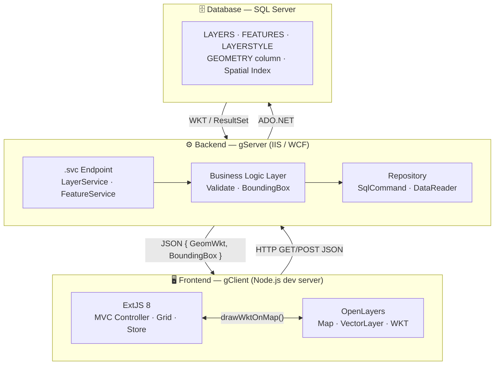

# Kiến trúc hệ thống

## Kiến trúc 3 tầng



## Cấu trúc thư mục

### gServer (Backend)

```
gServer/
├── Interfaces/
│   ├── ILayerService.cs
│   └── IFeatureService.cs
├── Services/
│   ├── LayerService.svc
│   └── FeatureService.svc
├── BusinessLogic/
│   ├── LayerBusiness.cs
│   └── FeatureBusiness.cs
├── Repository/
│   ├── LayerRepository.cs
│   └── FeatureRepository.cs
└── Models/
    ├── LayerDto.cs
    ├── FeatureDto.cs
    └── ServiceResult.cs
```

### gClient (Frontend)

```
gClient/
├── app/
│   ├── Application.js
│   ├── controller/
│   │   └── LayerController.js
│   ├── view/
│   │   ├── map/MapPanel.js
│   │   └── EditLayer/LayerGrid.js
│   ├── store/
│   │   └── LayerStore.js
│   └── model/
│       └── LayerModel.js
└── index.html
```

## Giao tiếp Frontend ↔ Backend

| Endpoint | Method | Mô tả |
|---|---|---|
| `/LayerService.svc/layers` | GET | Lấy danh sách tất cả layer |
| `/LayerService.svc/layers/{id}/features` | GET | Lấy features của 1 layer |
| `/LayerService.svc/features/{id}/geometry` | GET | Lấy WKT của 1 feature |
| `/LayerService.svc/layers/{id}/features-batch` | POST | Lấy WKT batch nhiều features |

!!! note "Định dạng response"
    Tất cả response đều bọc trong `ServiceResult<T>`:
    ```json
    {
      "Success": true,
      "Data": [...],
      "Message": ""
    }
    ```
