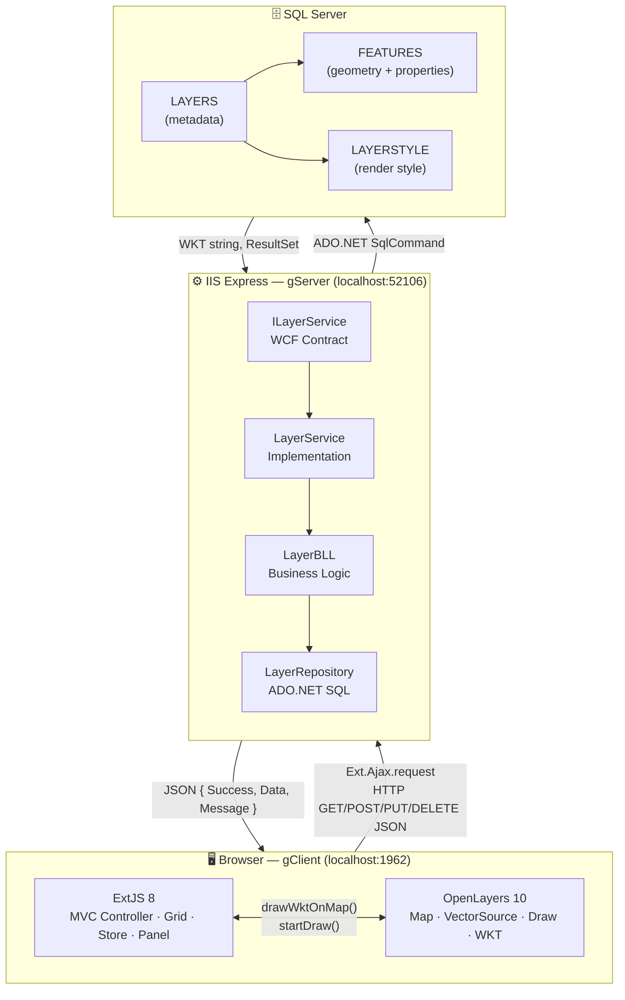
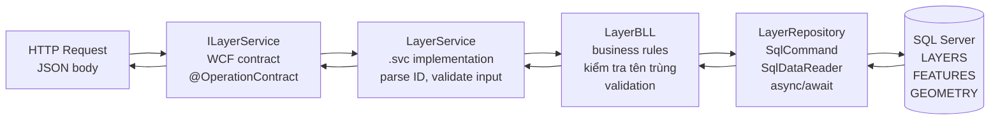
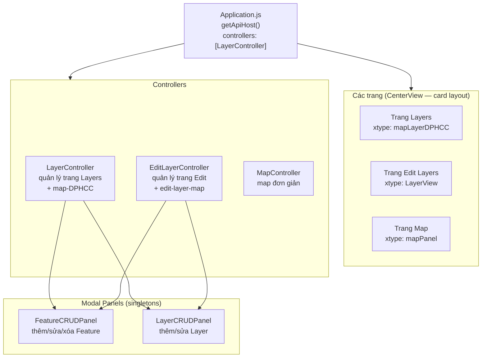
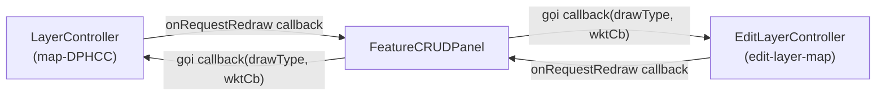

# Kiến trúc hệ thống

## Tổng thể — 3 tầng



---

## Kiến trúc Backend — 4 tầng



!!! note "Nguyên tắc phân tầng"
    - **ILayerService**: định nghĩa endpoint URL, method, format — **không có logic**
    - **LayerService**: nhận request, parse input, gọi BLL, bắt exception
    - **LayerBLL**: kiểm tra nghiệp vụ (tên trùng, ID hợp lệ), gọi Repository
    - **LayerRepository**: chỉ biết SQL, không biết HTTP hay business rule

---

## Kiến trúc Frontend — MVC ExtJS



---

## Hai bản đồ độc lập

!!! warning "Kiến trúc quan trọng"
    Dự án có **2 instance OpenLayers Map riêng biệt**, mỗi cái do một controller độc lập quản lý.

| Map | DOM id | Controller | Trang |
|---|---|---|---|
| Map chính | `#map-DPHCC` | `LayerController` | Trang "Layers" |
| Map Edit | `#edit-layer-map` | `EditLayerController` | Trang "Edit Layers" |

**Quy tắc bắt buộc:** `FeatureCRUDPanel` không hard-code controller nào. Khi cần redraw, nó gọi **callback được inject từ bên ngoài** — controller nào mở panel thì controller đó cung cấp draw function.



---

## Cấu trúc thư mục đầy đủ

```
gServer_0.0.1/
├── gClient_ExtJS/
│   └── g-client/
│       ├── app.json                         ← Sencha config
│       ├── index.html                       ← Entry (OL CDN, popup CSS)
│       └── app/desktop/src/
│           ├── Application.js               ← App entry, apiHost
│           ├── controller/
│           │   ├── LayerController.js       ← Trang Layers + map-DPHCC
│           │   └── MapController.js         ← Map đơn giản
│           ├── store/LayerStore.js
│           └── view/
│               ├── main/                    ← Shell (MainView, CenterView)
│               ├── home/                    ← Trang chủ
│               ├── map/MapPanel.js
│               ├── LAYERS/LayerPanel.js     ← Trang Layers (cls=map-DPHCC-cls)
│               ├── Features/                ← FeatureStore, FeatureModel
│               ├── EditLayer/
│               │   ├── LayerView.js         ← Trang Edit Layers
│               │   └── EditLayerController.js
│               ├── FeatureCRUD/
│               │   └── FeatureCRUDPanel.js  ← Modal CRUD Feature
│               └── LayerCRUD/
│                   └── LayerCRUDPanel.js    ← Modal CRUD Layer
│
└── gServer_0.0.1/
    ├── IServices/ILayerService.cs           ← WCF contract
    ├── Services/LayerService.cs             ← Implementation
    ├── Bussines/LayerBLL.cs                 ← Business logic
    ├── Repositories/LayerRepository.cs      ← SQL queries
    ├── Models/                              ← C# POCOs
    └── Web.config                           ← DB connection, log4net
```
