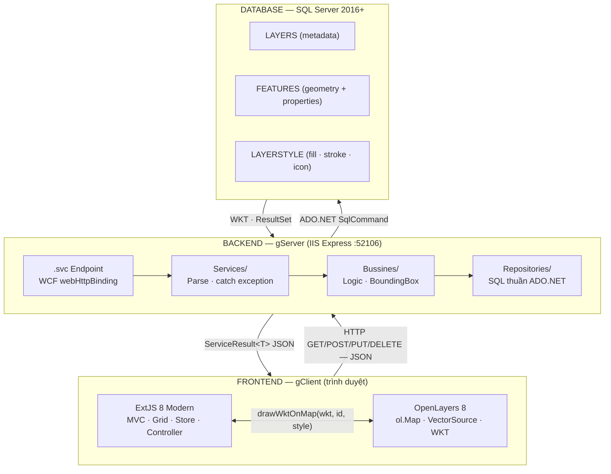
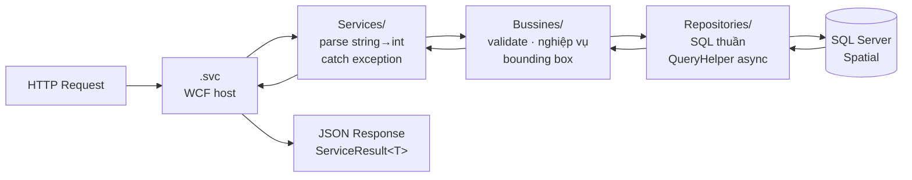
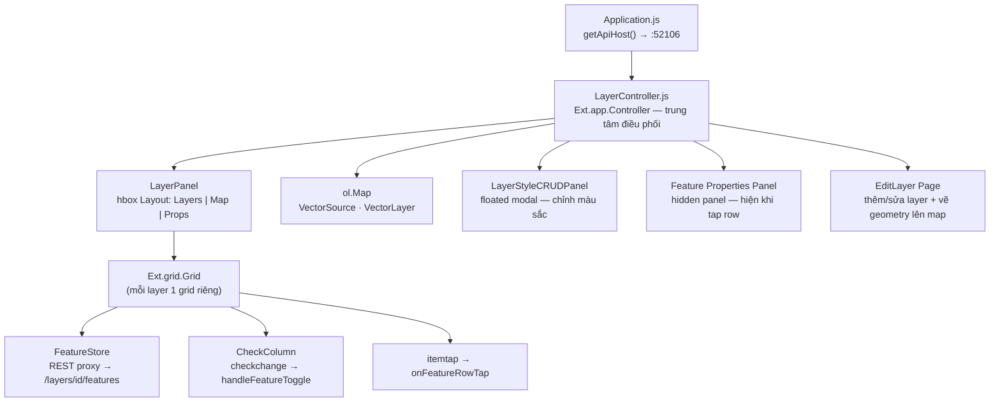

# Kiến trúc hệ thống

## Tổng quan 3 tầng

---

## Kiến trúc nội bộ Backend

Mỗi tầng chỉ biết về tầng kề dưới — không có phụ thuộc ngược.

| Tầng | Thư mục | Trách nhiệm |
|---|---|---|
| **WCF Host** | `LayerService.svc` | Route HTTP vào đúng interface method |
| **Interface** | `IServices/` | `[ServiceContract]` · `[WebGet]` · `[WebInvoke]` · UriTemplate |
| **Service** | `Services/` | Parse `string → int`, gọi BLL, catch exception cấp cao |
| **Business** | `Bussines/` | Validate input, kiểm tra trùng tên, tính `BoundingBox` (NTS) |
| **Repository** | `Repositories/` | SQL thuần — INSERT / SELECT / UPDATE / DELETE qua `QueryHelper` |
| **Model** | `Models/` | Entity, DTO, request payload, `ServiceResult<T>` |
| **Helper** | `Helper/` | `QueryHelper` (async ADO.NET), `LogHelper` (log4net), `ConnectionString` |

---

## Kiến trúc nội bộ Frontend

### Trạng thái nội bộ LayerController

| Property | Kiểu | Vai trò |
|---|---|---|
| `layerFeaturesCache` | `{ layerId: {features, bbox} }` | Cache WKT + bbox sau lần load đầu |
| `layerStyles` | `{ layerId: obj \| null \| undefined }` | Cache style — `undefined`=chưa fetch, `null`=không có style |
| `layerToggleState` | `{ layerId: bool }` | Trạng thái on/off toàn bộ layer (eye toggle) |
| `layerFeatureIds` | `{ layerId: [id…] }` | Danh sách feature ID đang hiển thị trên map |
| `hiddenFeatureIds` | `{ layerId: { featureId: true } }` | Feature bị người dùng tắt riêng bằng checkbox |
| `layerStores` | `{ layerId: Ext.data.Store }` | Store của từng layer grid |
| `layerLoading` | `{ layerId: bool }` | Guard chống double-load đồng thời |
| `currentPanelFeatureId` | `number \| null` | Feature đang mở properties panel |

---

## Tech Stack

=== "Backend"

    | Thư viện | Version | Dùng cho |
    |---|---|---|
    | .NET Framework | 4.5.1 | Runtime |
    | WCF `webHttpBinding` | built-in | REST JSON — không phải SOAP |
    | Newtonsoft.Json | 13.0.4 | Serialize/Deserialize JSON |
    | NetTopologySuite | 1.15.3 | Tính BoundingBox từ WKT |
    | GeoAPI | 1.7.5 | Phụ thuộc của NTS |
    | log4net | 2.0.0 | Ghi log rolling file theo ngày |
    | IIS Express | - | Dev host, port 52106 |

=== "Frontend"

    | Thư viện | Version | Dùng cho |
    |---|---|---|
    | ExtJS | 8 (Modern toolkit) | MVC · Grid · Form · Store · Controller |
    | OpenLayers | 8.x | Bản đồ tương tác · WKT rendering |
    | webpack | via Sencha Cmd | Bundle & hot reload |
    | Material Theme | - | UI theme ExtJS |

=== "Database"

    | Thành phần | Chi tiết |
    |---|---|
    | SQL Server | 2016+ (yêu cầu Spatial feature) |
    | Kiểu không gian | `GEOMETRY` (phẳng, SRID 4326) |
    | Spatial Index | `GEOMETRY_AUTO_GRID` bbox toàn Việt Nam (100–110, 8–24) |
    | Kết nối | ADO.NET thuần — `SqlConnection` / `SqlCommand` |
