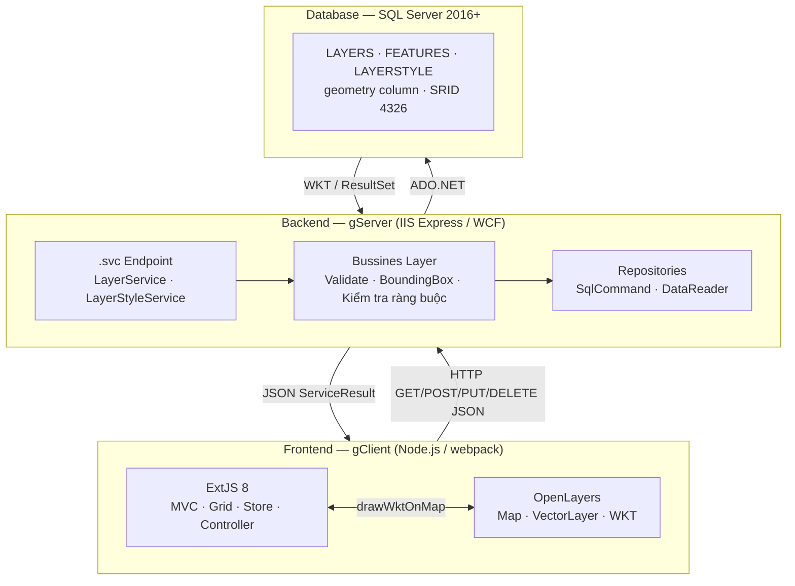
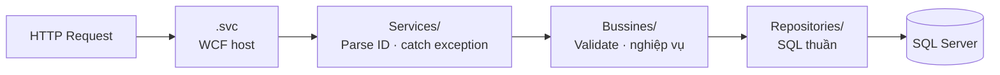

# Kiến trúc hệ thống

## Tổng quan 3 tầng



## Kiến trúc nội bộ gServer

Mỗi tầng chỉ biết về tầng kề dưới nó:



| Tầng | Thư mục | Trách nhiệm |
|---|---|---|
| Interface | `IServices/` | Khai báo WCF contract (`[ServiceContract]`, `[WebGet]`, `[WebInvoke]`) |
| Service | `Services/` | Parse string ID → int, gọi BLL, bắt exception cấp cao |
| Business | `Bussines/` | Validate input, kiểm tra nghiệp vụ, tính bounding box |
| Repository | `Repositories/` | SQL thuần qua `QueryHelper` — biết về DB, không biết về HTTP |
| Model | `Models/` | Entity, DTO, request/response payload |
| Helper | `Helper/` | DB connection, async SQL execution, log4net wrapper |

## Cấu trúc thư mục chi tiết

```
gServer_0.0.1/
├── LayerService.svc              ← WCF host: LayerService
├── LayerStyle.svc                ← WCF host: LayerStyleService
├── Web.config                    ← Binding, connection string, log4net
├── Global.asax.cs                ← CORS headers toàn cục
│
├── IServices/
│   ├── ILayerService.cs          ← 13 operation contract
│   └── ILayerStyleService.cs     ← 7 operation contract
│
├── Services/
│   ├── LayerService.cs           ← Triển khai ILayerService
│   ├── LayerStyleService.cs      ← Triển khai ILayerStyleService
│   └── WMSService.cs
│
├── Bussines/
│   ├── LayerBLL.cs               ← Nghiệp vụ Layer + Feature
│   └── LayerStyleBLL.cs          ← Nghiệp vụ LayerStyle
│
├── Repositories/
│   ├── LayerRepository.cs        ← SQL bảng LAYERS + FEATURES
│   └── LayerStyleRepository.cs   ← SQL bảng LAYERSTYLE
│
├── Models/
│   ├── Layer.cs                  ← Entity đầy đủ
│   ├── LayerListDto.cs           ← DTO danh sách (Id, Name, LayerType, IsVisible)
│   ├── LayerSaveDto.cs           ← DTO tạo/cập nhật
│   ├── LayerStyle.cs             ← Entity style (fill, stroke, icon)
│   ├── Feature.cs                ← Đối tượng không gian
│   ├── FeatureRequest.cs         ← Payload ghi (GeomWkt + Properties)
│   ├── FeatureCollection.cs      ← Danh sách Feature + BoundingBox
│   ├── FeatureInfoCollection.cs  ← Danh sách Feature (chỉ properties)
│   ├── FeatureBatchRequest.cs    ← { featureIds: [...] }
│   ├── IdentifyRequest.cs        ← { lon, lat }
│   ├── Envelope.cs               ← Bounding box (MinLat/MaxLat/MinLon/MaxLon)
│   ├── Geometry.cs               ← Wrapper WKT + SRID
│   ├── GeoJsonModels.cs          ← GeoJSON serialize
│   └── ServiceResult.cs          ← { Success, Message, Data<T> }
│
└── Helper/
    ├── QueryHelper.cs            ← ExecuteNonQuery/Scalar/Reader (async)
    ├── ConnectHelper.cs          ← Mở SqlConnection từ config
    ├── ConnectionString.cs       ← Đọc "geoDB" từ connectionStrings
    └── LogHelper.cs              ← LogInfo / LogError / LogWarn (log4net)
```

## Chuẩn response — ServiceResult\<T\>

Mọi endpoint đều trả về `ServiceResult<T>` để frontend xử lý đồng nhất:

```csharp
public class ServiceResult<T>
{
    public bool    Success { get; set; }
    public string  Message { get; set; }
    public T       Data    { get; set; }
}
```

```json
{
  "Success": true,
  "Message": "Tạo lớp bản đồ mới thành công!",
  "Data": { "Id": 5, "Name": "Điểm dân cư", "LayerType": "POINT" }
}
```

!!! info "Các endpoint trả kiểu khác"
    Một số endpoint trả thẳng `Feature`, `FeatureCollection`, `FeatureInfoCollection` (không bọc ServiceResult) để đơn giản hóa xử lý phía client.

## Giao tiếp Frontend ↔ Backend

| Endpoint | Method | Mô tả |
|---|---|---|
| `/LayerService.svc/layers` | GET | Lấy danh sách layer |
| `/LayerService.svc/layers` | POST | Tạo layer mới |
| `/LayerService.svc/layers/{Id}` | PUT | Cập nhật layer |
| `/LayerService.svc/layers/{Id}` | DELETE | Xóa layer |
| `/LayerService.svc/layers/{layerId}/features` | GET | Lấy features (chỉ properties) |
| `/LayerService.svc/layers/{layerId}/features` | POST | Thêm feature |
| `/LayerService.svc/features/{id}` | GET | Lấy feature đầy đủ |
| `/LayerService.svc/features/{id}` | PUT | Cập nhật feature |
| `/LayerService.svc/features/{id}` | DELETE | Xóa feature |
| `/LayerService.svc/features/{id}/geometry` | GET | Lấy WKT geometry |
| `/LayerService.svc/layers/{layerId}/features/import` | POST | Import hàng loạt |
| `/LayerService.svc/layers/{layerId}/features-batch` | POST | Lấy geometry theo ID list |
| `/LayerService.svc/identify` | POST | Identify theo lon/lat |
| `/LayerStyle.svc/layerstyles` | GET/POST | Danh sách / tạo style |
| `/LayerStyle.svc/layerstyles/{id}` | GET/PUT/DELETE | Chi tiết / sửa / xóa style |
| `/LayerStyle.svc/layers/{layerId}/style` | GET/DELETE | Style của layer |
