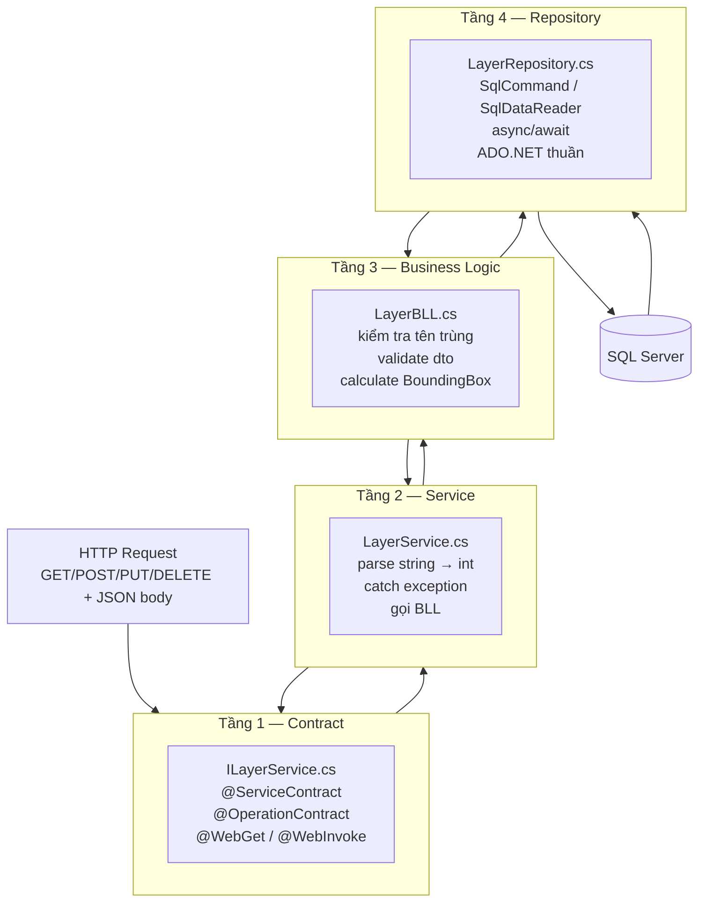

# Backend — gServer

## Tổng quan

gServer là **WCF REST service** chạy trên IIS Express, cung cấp toàn bộ dữ liệu cho frontend qua HTTP/JSON.

```
http://localhost:52106/LayerService.svc/{endpoint}
```

---

## Kiến trúc 4 tầng



---

## Tầng 1 — ILayerService (Contract)

Định nghĩa **những gì** service cung cấp — URL, method, format. Không có logic.

```csharp
[ServiceContract]
public interface ILayerService
{
    [OperationContract]
    [WebGet(UriTemplate = "layers", ResponseFormat = WebMessageFormat.Json)]
    Task<ServiceResult<List<LayerListDto>>> GetLayersAsync();

    [OperationContract]
    [WebInvoke(Method = "POST",
               UriTemplate = "/layers/{layerId}/features",
               RequestFormat  = WebMessageFormat.Json,
               ResponseFormat = WebMessageFormat.Json)]
    Task<ServiceResult<int>> AddFeatureAsync(string layerId, FeatureRequest feature);

    [OperationContract]
    [WebInvoke(Method = "PUT",
               UriTemplate = "/features/{id}",
               RequestFormat  = WebMessageFormat.Json,
               ResponseFormat = WebMessageFormat.Json)]
    Task<ServiceResult<int>> UpdateFeatureAsync(string id, FeatureRequest feature);

    [OperationContract]
    [WebInvoke(Method = "POST",
               UriTemplate = "/identify",
               RequestFormat  = WebMessageFormat.Json,
               ResponseFormat = WebMessageFormat.Json)]
    Task<FeatureCollection> IdentifyAsync(IdentifyRequest request);
}
```

!!! note "Lưu ý URL parameter"
    WCF URL template chỉ nhận `string`. Mọi `{id}`, `{layerId}` đều là string, Service tự parse sang `int`.

---

## Tầng 2 — LayerService (Implementation)

Tiếp nhận request, validate input cơ bản, gọi BLL, bắt exception.

```csharp
public async Task<ServiceResult<int>> AddFeatureAsync(string layerId, FeatureRequest feature)
{
    try
    {
        if (!int.TryParse(layerId, out int intLayerId))
            throw new WebFaultException<string>(
                "layerId không hợp lệ", HttpStatusCode.BadRequest);

        return await _layerBLL.AddFeatureAsync(intLayerId, feature);
    }
    catch (Exception ex)
    {
        LogHelper.LogError($"[LayerService.AddFeatureAsync] layerId={layerId}", ex);
        return new ServiceResult<int> { Success = false, Message = "Lỗi hệ thống: " + ex.Message };
    }
}
```

---

## Tầng 3 — LayerBLL (Business Logic)

Kiểm tra nghiệp vụ: tên trùng, dữ liệu hợp lệ, tính BoundingBox...

```csharp
public async Task<ServiceResult<LayerSaveDto>> CreateLayerAsync(LayerSaveDto dto)
{
    // Validate
    if (dto == null || string.IsNullOrWhiteSpace(dto.Name))
        return Fail("Tên Layer không được để trống!");

    // Kiểm tra trùng tên
    bool isExist = await _layerRepository.CheckNameExist(dto.Name, 0);
    if (isExist)
        return Fail("Tên Layer đã tồn tại trên hệ thống!");

    // Gọi repository
    return await _layerRepository.InsertAsync(dto);
}
```

---

## Tầng 4 — LayerRepository (Data Access)

Chỉ biết SQL — không biết HTTP hay business rule. Dùng ADO.NET thuần.

```csharp
public async Task<int> InsertAsync(Layer entity)
{
    string sql = @"
        INSERT INTO LAYERS (Name, Source, Description, LayerType, IsVisible, Opacity, MinZoom, MaxZoom)
        VALUES (@Name, @Source, @Description, @LayerType, @IsVisible, @Opacity, @MinZoom, @MaxZoom);
        SELECT SCOPE_IDENTITY();";

    var parameters = new Dictionary<string, object> {
        { "@Name",        entity.Name },
        { "@LayerType",   entity.LayerType },
        { "@IsVisible",   entity.IsVisible },
        { "@Opacity",     entity.Opacity },
        // ...
    };

    object result = await _queryHelper.ExecuteScalarAsync(sql, parameters);
    return Convert.ToInt32(result);
}
```

**Geometry — lưu và đọc WKT:**
```csharp
// INSERT feature
string sql = @"
    INSERT INTO FEATURES (LayerId, Geom, Properties)
    VALUES (@LayerId, geometry::STGeomFromText(@GeomWkt, 4326), @Properties)";

// SELECT feature
string sql = @"
    SELECT Id, Geom.STAsText() AS GeomWkt, Properties
    FROM FEATURES WHERE Id = @Id";
```

---

## Models C#

```csharp
// Wrapper chung cho mọi response
public class ServiceResult<T> {
    public bool    Success { get; set; }
    public string  Message { get; set; }
    public T       Data    { get; set; }
}

// Feature đầy đủ
public class Feature {
    public string Id         { get; set; }
    public string GeomWkt    { get; set; }
    public Dictionary<string, object> Properties { get; set; }
}

// Request thêm/sửa feature từ FE
public class FeatureRequest {
    public string Id         { get; set; }
    public string GeomWkt    { get; set; }
    public string Properties { get; set; }  // JSON string từ FE
}

// Layer metadata
public class LayerListDto {
    public int    Id        { get; set; }
    public string Name      { get; set; }
    public string LayerType { get; set; }
    public bool   IsVisible { get; set; }
}

// Identify request
public class IdentifyRequest {
    public double lon { get; set; }
    public double lat { get; set; }
}

// Batch request
public class FeatureBatchRequest {
    public List<int> FeatureIds { get; set; }
}

// BoundingBox
public class BoundingBox {
    public double MinLon { get; set; }
    public double MinLat { get; set; }
    public double MaxLon { get; set; }
    public double MaxLat { get; set; }
}
```

---

## Logging — log4net

Mọi lỗi đều được ghi vào file log rolling theo ngày.

```csharp
LogHelper.LogError("[LayerService.GetLayersAsync] Lỗi khi lấy danh sách Layer", ex);
LogHelper.LogInfo($"[AddFeature] Request: {JsonConvert.SerializeObject(feature)}");
```

**Cấu hình** (`Web.config`):
```xml
<appender name="RollingFile" type="log4net.Appender.RollingFileAppender">
    <file value="logs\\WCF.log" />
    <maximumFileSize value="10MB" />
    <maxSizeRollBackups value="10" />
</appender>
```

Log file: `gServer_0.0.1/logs/WCF.log`

---

## Cấu hình kết nối DB

```xml
<!-- Web.config -->
<connectionStrings>
    <add name="geoDB"
         connectionString="Server=10.0.1.207\sql2k16;Database=gServer_dev_DB;User=sa;Password=***"
         providerName="System.Data.SqlClient" />
</connectionStrings>
```

---

## Xử lý lỗi — Quy tắc

!!! warning "Server luôn trả HTTP 200"
    Ngay cả khi nghiệp vụ thất bại (tên trùng, không tìm thấy...), server vẫn trả `200 OK`.  
    Frontend **phải** kiểm tra `result.Success` trong body JSON, không dựa vào HTTP status code.

| Trường hợp | HTTP | Body |
|---|---|---|
| ID không phải số | `400 Bad Request` | `"Id không hợp lệ"` |
| Tên layer trùng | `200 OK` | `{ "Success": false, "Message": "Tên Layer đã tồn tại..." }` |
| Lỗi SQL/hệ thống | `200 OK` | `{ "Success": false, "Message": "Lỗi hệ thống: ..." }` |
| Thành công | `200 OK` | `{ "Success": true, "Data": {...} }` |
