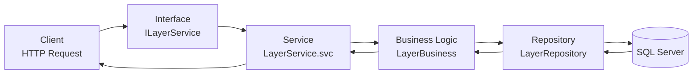

# Backend — gServer

## Tổng quan kiến trúc 4 tầng



Mỗi tầng có trách nhiệm rõ ràng, không tầng nào biết chi tiết của tầng cách nó 2 bước.

## Tầng Interface

Định nghĩa contract cho WCF — mô tả **những gì** service cung cấp, không quan tâm **thế nào**.

```csharp
[ServiceContract]
public interface ILayerService
{
    [OperationContract]
    [WebGet(UriTemplate = "/layers", ResponseFormat = WebMessageFormat.Json)]
    ServiceResult<List<LayerDto>> GetAllLayers();

    [OperationContract]
    [WebInvoke(Method = "POST",
               UriTemplate = "/layers/{layerId}/features-batch",
               ResponseFormat = WebMessageFormat.Json)]
    ServiceResult<FeatureBatchResult> GetFeaturesBatch(string layerId, BatchRequest request);
}
```

## Tầng Service (.svc)

Tiếp nhận HTTP request, gọi xuống BLL, trả về JSON.

```csharp
public class LayerService : ILayerService
{
    private readonly LayerBusiness _business = new LayerBusiness();

    public ServiceResult<List<LayerDto>> GetAllLayers()
    {
        return _business.GetAllLayers();
    }
}
```

## Tầng Business Logic

Xử lý nghiệp vụ: validate, tính BoundingBox, kiểm tra quyền...

```csharp
public class FeatureBusiness
{
    public ServiceResult<FeatureBatchResult> GetFeaturesBatch(int layerId, List<int> ids)
    {
        var features = _repo.GetByIds(ids);
        var bbox = CalculateBoundingBox(features);
        return ServiceResult<FeatureBatchResult>.Success(
            new FeatureBatchResult { Features = features, BoundingBox = bbox }
        );
    }

    private BoundingBox CalculateBoundingBox(List<FeatureDto> features)
    {
        // Tính min/max lon-lat từ tập hợp WKT
    }
}
```

## Tầng Repository

Trực tiếp truy vấn SQL Server — chỉ biết về database, không biết về HTTP hay nghiệp vụ.

```csharp
public class FeatureRepository
{
    public List<FeatureDto> GetByIds(List<int> ids)
    {
        var sql = $@"
            SELECT Id, LayerId, Geom.STAsText() AS GeomWkt, Properties
            FROM FEATURES
            WHERE Id IN ({string.Join(",", ids)})";

        using (var conn = new SqlConnection(ConnectionString))
        using (var cmd = new SqlCommand(sql, conn))
        {
            conn.Open();
            using (var reader = cmd.ExecuteReader())
            {
                // map từng dòng → FeatureDto
            }
        }
    }
}
```

## ServiceResult — Chuẩn response

Mọi response đều bọc trong `ServiceResult<T>` để frontend xử lý đồng nhất:

```csharp
public class ServiceResult<T>
{
    public bool Success { get; set; }
    public T Data { get; set; }
    public string Message { get; set; }

    public static ServiceResult<T> Ok(T data) =>
        new ServiceResult<T> { Success = true, Data = data };

    public static ServiceResult<T> Fail(string msg) =>
        new ServiceResult<T> { Success = false, Message = msg };
}
```

## Cấu hình WCF (Web.config)

!!! info "webHttpBinding"
    Project dùng `webHttpBinding` (REST) thay vì `basicHttpBinding` (SOAP) để trả về JSON cho ExtJS.
