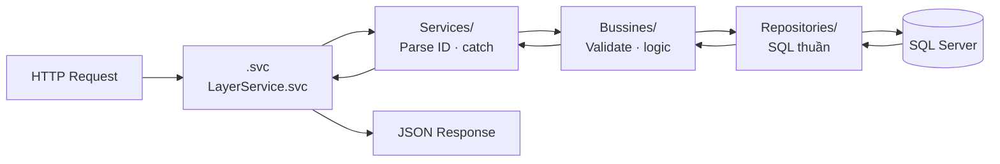

# Backend — gServer

## Stack

| Thành phần | Chi tiết |
|---|---|
| Runtime | .NET Framework 4.5.1 |
| Service | WCF `webHttpBinding` — REST/JSON (không phải SOAP) |
| Host | IIS Express port **52106** |
| Database | SQL Server 2016+ — ADO.NET thuần |
| Spatial | NetTopologySuite 1.15.3 + GeoAPI 1.7.5 |
| JSON | Newtonsoft.Json 13.0.4 |
| Logging | log4net 2.0.0 → `logs\WCF.log` |

## Kiến trúc nội bộ



## Tầng Interface — IServices/

Khai báo WCF contract. `[WebGet]` = GET, `[WebInvoke]` = POST/PUT/DELETE.

```csharp
[ServiceContract]
public interface ILayerService
{
    [OperationContract]
    [WebGet(UriTemplate = "layers", ResponseFormat = WebMessageFormat.Json)]
    Task<ServiceResult<List<LayerListDto>>> GetLayersAsync();

    [OperationContract]
    [WebInvoke(Method = "POST", UriTemplate = "layers/{layerId}/features-batch",
               RequestFormat = WebMessageFormat.Json,
               ResponseFormat = WebMessageFormat.Json)]
    Task<FeatureCollection> GetFeaturesBatchAsync(string layerId, FeatureBatchRequest request);
}
```

## Tầng Service — Services/

Tiếp nhận request, parse string ID → int, gọi BLL, bắt exception cấp cao.

```csharp
public class LayerService : ILayerService
{
    private readonly LayerBLL _layerBLL = new LayerBLL();

    public async Task<ServiceResult<List<LayerListDto>>> GetLayersAsync()
    {
        try
        {
            return await _layerBLL.GetLayersAsync();
        }
        catch (Exception ex)
        {
            LogHelper.LogError("[LayerService.GetLayersAsync]", ex);
            return new ServiceResult<List<LayerListDto>>
            {
                Success = false,
                Message = "Lỗi hệ thống: " + ex.Message
            };
        }
    }

    public async Task<ServiceResult<int>> DeleteLayerAsync(string Id)
    {
        if (!int.TryParse(Id, out int intId))
            return new ServiceResult<int> { Success = false, Message = "Id không hợp lệ!" };

        try { return await _layerBLL.DeleteLayerAsync(intId); }
        catch (Exception ex)
        {
            LogHelper.LogError($"[LayerService.DeleteLayerAsync] Id: {Id}", ex);
            return new ServiceResult<int> { Success = false, Message = "Lỗi hệ thống: " + ex.Message };
        }
    }
}
```

## Tầng Business Logic — Bussines/

Validate input, kiểm tra ràng buộc, tính bounding box.

```csharp
public class LayerBLL
{
    private readonly LayerRepository _repo = new LayerRepository();

    public async Task<ServiceResult<LayerSaveDto>> CreateLayerAsync(LayerSaveDto dto)
    {
        if (string.IsNullOrWhiteSpace(dto.Name))
            return new ServiceResult<LayerSaveDto> { Success = false, Message = "Tên lớp không được trống!" };

        // Kiểm tra trùng tên
        var exists = await _repo.ExistsByNameAsync(dto.Name);
        if (exists)
            return new ServiceResult<LayerSaveDto> { Success = false, Message = "Tên lớp đã tồn tại!" };

        var id = await _repo.InsertAsync(dto);
        dto.Id = id;
        return new ServiceResult<LayerSaveDto>
        {
            Success = true,
            Message = "Tạo lớp bản đồ mới thành công!",
            Data = dto
        };
    }

    public async Task<FeatureCollection> GetFeaturesByListIdsAsync(FeatureBatchRequest request)
    {
        var features = await _repo.GetFeaturesByIdsAsync(request.featureIds);
        var bbox = CalculateBoundingBox(features);
        return new FeatureCollection { Features = features, BoundingBox = bbox };
    }

    private Envelope CalculateBoundingBox(List<Feature> features) { /* NTS WKTReader */ }
}
```

## Tầng Repository — Repositories/

SQL thuần qua `QueryHelper`. Không biết về HTTP hay business logic.

```csharp
public class LayerRepository
{
    public async Task<List<LayerListDto>> GetAllAsync()
    {
        const string sql = @"
            SELECT Id, Name, Source, Description, LayerType,
                   IsVisible, Opacity, MinZoom, MaxZoom
            FROM   LAYERS
            ORDER BY Id";

        var result = new List<LayerListDto>();
        await QueryHelper.ExecuteReaderAsync(sql, null, reader =>
        {
            result.Add(new LayerListDto
            {
                Id        = reader.GetInt32(0),
                Name      = reader.GetString(1),
                LayerType = reader.GetString(4),
                IsVisible = reader.GetBoolean(5)
            });
        });
        return result;
    }
}
```

## Helper — QueryHelper (async)

Wrapper ADO.NET. Lấy connection từ `ConnectionString.GetConnectionString()`.

```csharp
// ExecuteNonQuery — INSERT/UPDATE/DELETE
await QueryHelper.ExecuteNonQueryAsync(sql, parameters);

// ExecuteScalar — lấy 1 giá trị (ví dụ: Id vừa insert)
int newId = await QueryHelper.ExecuteScalarAsync<int>(sql, parameters);

// ExecuteReader — đọc nhiều dòng
await QueryHelper.ExecuteReaderAsync(sql, parameters, reader => { /* map row */ });
```

## Cấu hình WCF (Web.config)

```xml
<system.serviceModel>
  <services>
    <service name="gServer_0._0._1.Services.LayerService">
      <endpoint address="" behaviorConfiguration="webHttpBehavior"
                binding="webHttpBinding" bindingConfiguration="customWebBinding"
                name="layer" contract="gServer_0._0._1.IServices.ILayerService" />
    </service>
    <service name="gServer_0._0._1.Services.LayerStyleService">
      <endpoint address="" behaviorConfiguration="webHttpBehavior"
                binding="webHttpBinding" bindingConfiguration="customWebBinding"
                name="layerStyle" contract="gServer_0._0._1.IServices.ILayerStyleService" />
    </service>
  </services>
  <bindings>
    <webHttpBinding>
      <binding name="customWebBinding"
               maxReceivedMessageSize="104857600"
               maxBufferSize="104857600">
        <security mode="None" />
      </binding>
    </webHttpBinding>
  </bindings>
  <behaviors>
    <endpointBehaviors>
      <behavior name="webHttpBehavior">
        <webHttp helpEnabled="true" defaultBodyStyle="Bare"
                 defaultOutgoingResponseFormat="Json"/>
      </behavior>
    </endpointBehaviors>
  </behaviors>
</system.serviceModel>
```

!!! info "webHttpBinding"
    Project dùng `webHttpBinding` (REST JSON), không phải `basicHttpBinding` (SOAP). Điều này cho phép gọi trực tiếp từ `Ext.Ajax.request` mà không cần SOAP client.

## CORS — Global.asax.cs

CORS được inject toàn cục trong `Application_BeginRequest`:

```csharp
protected void Application_BeginRequest(object sender, EventArgs e)
{
    HttpContext.Current.Response.AddHeader("Access-Control-Allow-Origin", "*");
    HttpContext.Current.Response.AddHeader("Access-Control-Allow-Methods",
        "GET, POST, PUT, DELETE, OPTIONS");
    HttpContext.Current.Response.AddHeader("Access-Control-Allow-Headers",
        "Content-Type, Accept, Authorization");

    if (HttpContext.Current.Request.HttpMethod == "OPTIONS")
    {
        HttpContext.Current.Response.StatusCode = 200;
        HttpContext.Current.Response.End();
    }
}
```

## API Reference

### Base URL

```
http://localhost:52106/LayerService.svc
http://localhost:52106/LayerStyle.svc
```

---

### LayerService — Layer CRUD

=== "GET /layers"
    Lấy danh sách tất cả layer.

    **Response:**
    ```json
    {
      "Success": true,
      "Data": [
        { "Id": 1, "Name": "Điểm dân cư", "LayerType": "POINT", "IsVisible": true }
      ],
      "Message": null
    }
    ```

=== "POST /layers"
    Tạo layer mới.

    **Body:**
    ```json
    {
      "Name": "Điểm dân cư",
      "Source": "local",
      "Description": "Mô tả tùy chọn",
      "LayerType": "POINT",
      "IsVisible": true,
      "Opacity": 1.0,
      "MinZoom": 0,
      "MaxZoom": 22
    }
    ```

    **Response:** `ServiceResult<LayerSaveDto>`

=== "PUT /layers/{Id}"
    Cập nhật layer. Body giống POST.

=== "DELETE /layers/{Id}"
    Xóa layer và tất cả feature liên quan.

---

### LayerService — Feature CRUD

=== "GET /layers/{layerId}/features"
    Lấy danh sách feature (chỉ properties, không geometry).

=== "POST /layers/{layerId}/features"
    Thêm 1 feature.

    **Body:**
    ```json
    {
      "GeomWkt": "POINT(105.8342 21.0278)",
      "Properties": "{\"ten\": \"Hà Nội\", \"dan_so\": 8000000}"
    }
    ```

=== "PUT /features/{id}"
    Cập nhật geometry và properties.

=== "DELETE /features/{id}"
    Xóa feature.

=== "GET /features/{id}"
    Lấy feature đầy đủ (geometry + properties).

=== "GET /features/{featureId}/geometry"
    Lấy WKT geometry của feature.

---

### LayerService — Thao tác nâng cao

=== "POST /layers/{layerId}/features/import"
    Import hàng loạt `FeatureCollection` vào layer.

    **Body:**
    ```json
    {
      "Features": [
        { "GeomWkt": "POINT(105.0 21.0)", "Properties": "{}" }
      ]
    }
    ```

=== "POST /layers/{layerId}/features-batch"
    Lấy geometry của nhiều feature theo danh sách ID.

    **Body:**
    ```json
    { "featureIds": [1, 2, 3, 4] }
    ```

    **Response:** `FeatureCollection` (có `BoundingBox`).

=== "POST /identify"
    Tìm tất cả feature giao với điểm lon/lat (buffer 5m).

    **Body:**
    ```json
    { "lon": 105.8342, "lat": 21.0278 }
    ```

---

### LayerStyleService — Style

| Method | Endpoint | Mô tả |
|---|---|---|
| GET | `/layerstyles` | Lấy tất cả style |
| GET | `/layerstyles/{id}` | Lấy style theo Id |
| GET | `/layers/{layerId}/style` | Lấy style của layer |
| POST | `/layerstyles` | Tạo style mới |
| PUT | `/layerstyles/{id}` | Cập nhật style |
| DELETE | `/layerstyles/{id}` | Xóa style |
| DELETE | `/layers/{layerId}/style` | Xóa style của layer |

**Body POST/PUT:**
```json
{
  "LayerId": 1,
  "FillColor": "#3399CC",
  "StrokeColor": "#FFFFFF",
  "StrokeWidth": 1.5,
  "IconUrl": null
}
```

## Định dạng WKT

Tọa độ theo thứ tự **kinh độ (X) trước, vĩ độ (Y) sau**, SRID 4326.

| Loại | Ví dụ |
|---|---|
| Point | `POINT(105.8342 21.0278)` |
| LineString | `LINESTRING(105.0 21.0, 106.0 21.5, 107.0 22.0)` |
| Polygon | `POLYGON((105.0 21.0, 106.0 21.0, 106.0 22.0, 105.0 22.0, 105.0 21.0))` |

!!! warning "Polygon phải đóng vòng"
    Điểm cuối phải trùng điểm đầu. `POLYGON((A, B, C, D, A))`.

## Logging

Ghi file rolling theo ngày tại `logs\WCF.log`:

```
2026-06-25 10:30:00 [Thread 5] INFO  LayerBLL - Tạo lớp bản đồ mới thành công!
2026-06-25 10:30:01 [Thread 5] ERROR LayerService - [GetLayersAsync] Lỗi hệ thống
```

Đổi `<level value="INFO" />` thành `DEBUG` trong `Web.config` để log chi tiết hơn.
