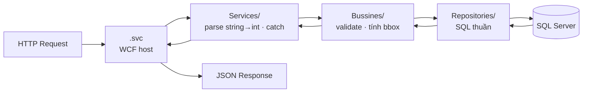

# Backend — gServer

## Stack

| Thành phần | Chi tiết |
|---|---|
| Runtime | .NET Framework **4.5.1** |
| Service | WCF `webHttpBinding` — REST JSON (không phải SOAP) |
| Host | IIS Express port **52106** |
| Database | SQL Server 2016+ — ADO.NET thuần |
| Spatial | NetTopologySuite 1.15.3 + GeoAPI 1.7.5 |
| JSON | Newtonsoft.Json 13.0.4 |
| Logging | log4net 2.0.0 → `logs\WCF.log` (rolling theo ngày) |

---

## Kiến trúc nội bộ



---

## Tầng Interface — IServices/

Khai báo WCF contract. `[WebGet]` = GET · `[WebInvoke]` = POST/PUT/DELETE.

=== "ILayerService.cs"

    ```csharp
    [ServiceContract]
    public interface ILayerService
    {
        [OperationContract]
        [WebGet(UriTemplate = "layers", ResponseFormat = WebMessageFormat.Json)]
        Task<ServiceResult<List<LayerListDto>>> GetLayersAsync();

        [OperationContract]
        [WebInvoke(Method = "POST",
                   UriTemplate = "/layers/{layerId}/features-batch",
                   RequestFormat  = WebMessageFormat.Json,
                   ResponseFormat = WebMessageFormat.Json)]
        Task<FeatureCollection> GetFeaturesBatchAsync(string layerId,
                                                      FeatureBatchRequest request);

        [OperationContract]
        [WebInvoke(Method = "POST",
                   UriTemplate = "/identify",
                   RequestFormat  = WebMessageFormat.Json,
                   ResponseFormat = WebMessageFormat.Json)]
        Task<ServiceResult<List<Feature>>> IdentifyAsync(IdentifyRequest request);
    }
    ```

=== "ILayerStyleService.cs"

    ```csharp
    [ServiceContract]
    public interface ILayerStyleService
    {
        [OperationContract]
        [WebGet(UriTemplate = "layers/{layerId}/style",
                ResponseFormat = WebMessageFormat.Json)]
        Task<ServiceResult<LayerStyle>> GetStyleByLayerAsync(string layerId);

        [OperationContract]
        [WebInvoke(Method = "POST", UriTemplate = "layerstyles",
                   RequestFormat  = WebMessageFormat.Json,
                   ResponseFormat = WebMessageFormat.Json)]
        Task<ServiceResult<LayerStyle>> CreateStyleAsync(LayerStyle style);

        [OperationContract]
        [WebInvoke(Method = "PUT", UriTemplate = "layerstyles/{id}",
                   RequestFormat  = WebMessageFormat.Json,
                   ResponseFormat = WebMessageFormat.Json)]
        Task<ServiceResult<LayerStyle>> UpdateStyleAsync(string id, LayerStyle style);
    }
    ```

---

## Tầng Service — Services/

Tiếp nhận request, parse string ID → int, gọi BLL, bắt exception cấp cao.

```csharp
public class LayerService : ILayerService
{
    private readonly LayerBLL _bll = new LayerBLL();

    public async Task<ServiceResult<List<LayerListDto>>> GetLayersAsync()
    {
        try   { return await _bll.GetLayersAsync(); }
        catch (Exception ex)
        {
            LogHelper.LogError("[LayerService.GetLayersAsync]", ex);
            return new ServiceResult<List<LayerListDto>>
                { Success = false, Message = "Lỗi hệ thống: " + ex.Message };
        }
    }

    public async Task<ServiceResult<int>> DeleteLayerAsync(string Id)
    {
        if (!int.TryParse(Id, out int id))
            return new ServiceResult<int>
                { Success = false, Message = "Id không hợp lệ!" };
        try   { return await _bll.DeleteLayerAsync(id); }
        catch (Exception ex)
        {
            LogHelper.LogError($"[DeleteLayerAsync] Id={Id}", ex);
            return new ServiceResult<int>
                { Success = false, Message = "Lỗi hệ thống: " + ex.Message };
        }
    }
}
```

---

## Tầng Business — Bussines/

Validate input, kiểm tra ràng buộc nghiệp vụ, tính bounding box.

```csharp
public class LayerBLL
{
    private readonly LayerRepository _repo = new LayerRepository();

    public async Task<ServiceResult<LayerSaveDto>> CreateLayerAsync(LayerSaveDto dto)
    {
        // Validate
        if (string.IsNullOrWhiteSpace(dto.Name))
            return Fail("Tên lớp không được trống!");

        if (await _repo.ExistsByNameAsync(dto.Name))
            return Fail("Tên lớp đã tồn tại!");

        var id = await _repo.InsertAsync(dto);
        dto.Id = id;
        return Ok("Tạo lớp bản đồ mới thành công!", dto);
    }

    public async Task<FeatureCollection> GetFeaturesByBatchAsync(FeatureBatchRequest req)
    {
        var features = await _repo.GetFeaturesByIdsAsync(req.featureIds);
        var bbox     = CalculateBoundingBox(features);   // NetTopologySuite WKTReader
        return new FeatureCollection { Features = features, BoundingBox = bbox };
    }
}
```

---

## Tầng Repository — Repositories/

SQL thuần qua `QueryHelper`. Không biết gì về HTTP hay business logic.

```csharp
public class LayerRepository
{
    public async Task<List<LayerListDto>> GetAllAsync()
    {
        const string sql = @"
            SELECT Id, Name, Source, Description, LayerType,
                   IsVisible, Opacity, MinZoom, MaxZoom
            FROM   LAYERS ORDER BY Id";

        var list = new List<LayerListDto>();
        await QueryHelper.ExecuteReaderAsync(sql, null, r =>
        {
            list.Add(new LayerListDto {
                Id        = r.GetInt32(0),
                Name      = r.GetString(1),
                LayerType = r.GetString(4),
                IsVisible = r.GetBoolean(5)
            });
        });
        return list;
    }

    public async Task<List<Feature>> GetFeaturesByIdsAsync(List<int> ids)
    {
        var inClause = string.Join(",", ids);
        var sql = $@"SELECT Id, LayerId, Geom.STAsText() AS GeomWkt, Properties
                     FROM FEATURES WHERE Id IN ({inClause})";
        // ...
    }
}
```

---

## Helper — QueryHelper (async ADO.NET)

Wrapper tái sử dụng cho tất cả thao tác DB. Tự lấy connection từ `ConnectionString`.

```csharp
// INSERT / UPDATE / DELETE
await QueryHelper.ExecuteNonQueryAsync(sql, parameters);

// Lấy 1 giá trị (ví dụ: Id vừa INSERT)
int newId = await QueryHelper.ExecuteScalarAsync<int>(sql, parameters);

// Đọc nhiều dòng
await QueryHelper.ExecuteReaderAsync(sql, parameters, reader => {
    /* map từng dòng vào object */
});
```

---

## Model — ServiceResult&lt;T&gt;

Wrapper response chuẩn cho toàn bộ API:

```csharp
public class ServiceResult<T>
{
    public bool    Success { get; set; }
    public string  Message { get; set; }
    public T       Data    { get; set; }
}
```

Response mẫu:
```json
{
  "Success": true,
  "Message": "Tạo lớp bản đồ mới thành công!",
  "Data": { "Id": 5, "Name": "Điểm dân cư", "LayerType": "point" }
}
```

---

## Cấu hình WCF — Web.config

```xml
<system.serviceModel>
  <services>
    <service name="gServer_0._0._1.Services.LayerService">
      <endpoint address="" behaviorConfiguration="webHttpBehavior"
                binding="webHttpBinding" bindingConfiguration="customBinding"
                contract="gServer_0._0._1.IServices.ILayerService" />
    </service>
    <service name="gServer_0._0._1.Services.LayerStyleService">
      <endpoint address="" behaviorConfiguration="webHttpBehavior"
                binding="webHttpBinding" bindingConfiguration="customBinding"
                contract="gServer_0._0._1.IServices.ILayerStyleService" />
    </service>
  </services>
  <bindings>
    <webHttpBinding>
      <binding name="customBinding"
               maxReceivedMessageSize="104857600"
               maxBufferSize="104857600">
        <security mode="None" />
      </binding>
    </webHttpBinding>
  </bindings>
  <behaviors>
    <endpointBehaviors>
      <behavior name="webHttpBehavior">
        <webHttp helpEnabled="true" defaultBodyStyle="Bare"
                 defaultOutgoingResponseFormat="Json" />
      </behavior>
    </endpointBehaviors>
  </behaviors>
</system.serviceModel>
```

!!! info "webHttpBinding — không phải SOAP"
    Project dùng `webHttpBinding` (REST JSON). Điều này cho phép gọi thẳng từ
    `Ext.Ajax.request` không cần SOAP client hay XML.

---

## CORS — Global.asax.cs

CORS được inject toàn cục trong `Application_BeginRequest`:

```csharp
protected void Application_BeginRequest(object sender, EventArgs e)
{
    HttpContext.Current.Response.AddHeader("Access-Control-Allow-Origin", "*");
    HttpContext.Current.Response.AddHeader("Access-Control-Allow-Methods",
        "GET, POST, PUT, DELETE, OPTIONS");
    HttpContext.Current.Response.AddHeader("Access-Control-Allow-Headers",
        "Content-Type, Accept, Authorization");

    if (HttpContext.Current.Request.HttpMethod == "OPTIONS")
    {
        HttpContext.Current.Response.StatusCode = 200;
        HttpContext.Current.Response.End();
    }
}
```

---

## Logging — log4net

Ghi file rolling theo ngày tại `logs\WCF.log`:

```
2026-06-25 10:30:00 [Thread 5] INFO  LayerBLL - Tạo lớp bản đồ mới thành công!
2026-06-25 10:30:01 [Thread 5] ERROR LayerService - [GetLayersAsync] Object reference error
```

Đổi level trong `Web.config`:
```xml
<log4net>
  <root>
    <level value="INFO" />   <!-- đổi thành DEBUG để log chi tiết -->
    <appender-ref ref="RollingFileAppender" />
  </root>
</log4net>
```
