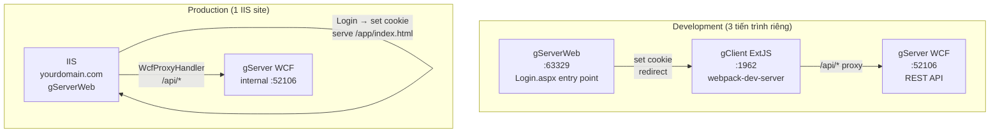
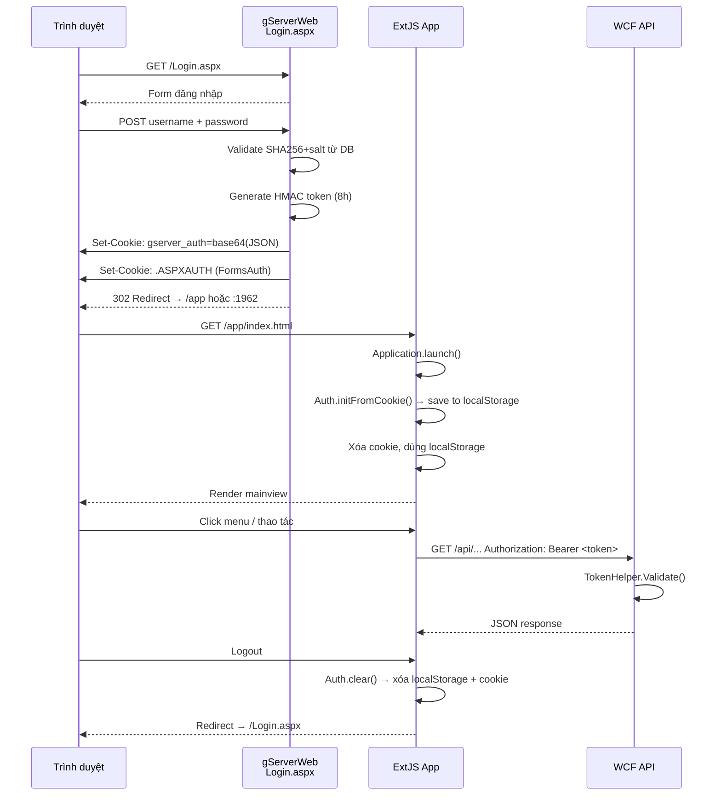

# Build & Triển khai

Hướng dẫn chạy môi trường **development** và đóng gói **production** cho toàn bộ hệ thống gServer/gClient.

---

## Kiến trúc triển khai



---

## Development

### Yêu cầu

| Công cụ | Phiên bản |
|---|---|
| Visual Studio 2022 | 17.x+ |
| .NET Framework | 4.5.1 |
| Node.js | 18+ |
| SQL Server | 2016+ (Spatial) |

### Bước 1 — Cơ sở dữ liệu

Chạy script tạo bảng USERS (nếu chưa có):

```sql
-- Từ file gServer_0.0.1/Create_Users_Table.sql
USE gServer_dev_DB;

CREATE TABLE USERS (
    Id           INT IDENTITY(1,1) PRIMARY KEY,
    Username     NVARCHAR(100) NOT NULL UNIQUE,
    Password     NVARCHAR(500) NOT NULL,   -- salt:sha256hash
    FullName     NVARCHAR(200),
    Email        NVARCHAR(200),
    Role         NVARCHAR(50)  NOT NULL DEFAULT 'user',
    IsActive     BIT           NOT NULL DEFAULT 1,
    CreatedAt    DATETIME      NOT NULL DEFAULT GETDATE()
);

-- Tạo tài khoản admin mặc định (password: Admin@123)
INSERT INTO USERS (Username, Password, FullName, Role)
VALUES ('admin', '<hash từ HashPassword()>', N'Administrator', 'admin');
```

!!! tip "Tạo hash password"
    Chạy `LoginPage.HashPassword("Admin@123")` từ code C# hoặc gọi WCF endpoint `POST /api/AuthService.svc/login`.

### Bước 2 — WCF Backend

=== "Visual Studio"

    1. Mở `gServer_0.0.1.sln` trong VS2022
    2. Set **gServer_0.0.1** làm Startup Project
    3. `Ctrl+F5` để chạy không debug (hoặc `F5` nếu cần breakpoint)
    4. WCF chạy tại `http://localhost:52106`

=== "PowerShell"

    ```powershell
    .\run-debug.ps1
    ```

### Bước 3 — ASP.NET Web (gServerWeb)

=== "Visual Studio"

    1. Chuột phải `gServerWeb` → **Set as Startup Project**
    2. `Ctrl+F5`
    3. Chạy tại `http://localhost:63329`

=== "Multiple Startup (khuyến nghị)"

    1. Chuột phải Solution → **Set Startup Projects**
    2. Chọn **Multiple startup projects**
    3. Đặt cả `gServer_0.0.1` và `gServerWeb` → **Start**

### Bước 4 — ExtJS Client

```powershell
cd gClient_ExtJS\g-client
npm install          # lần đầu
npm start            # webpack-dev-server :1962
```

### Bước 5 — Truy cập

Mở browser vào:

```
http://localhost:63329/Login.aspx
```

**Luồng hoàn chỉnh:**

```
Login.aspx  ──[validate DB]──►  set cookie gserver_auth
            ──[redirect]──────►  http://localhost:1962?loginUrl=http://localhost:63329/Login.aspx
ExtJS       ──[đọc cookie]────►  Auth.save() → mainview
API calls   ──[Bearer token]──►  /api/* → WCF :52106
Logout      ──[clear cookie]──►  redirect Login.aspx
```

### Port mặc định

| Service | Port | URL |
|---|---|---|
| gServerWeb (entry) | **63329** | `http://localhost:63329/Login.aspx` |
| gServer WCF | **52106** | `http://localhost:52106` |
| gClient ExtJS | **1962** | `http://localhost:1962` |
| MkDocs | **8000** | `http://localhost:8000` |

---

## Production Build

### Bước 1 — Build ExtJS

```powershell
cd gClient_ExtJS\g-client

# Build production bundle
npm run build
# Output: gClient_ExtJS\g-client\build\desktop\
```

!!! note "Cấu hình production"
    File `webpack.config.js` tự detect `environment=production` và tắt devServer, tắt source-map.

### Bước 2 — Copy vào gServerWeb

```powershell
# Tạo thư mục app trong gServerWeb
New-Item -ItemType Directory -Force "gServerWeb\app"

# Copy build output
Copy-Item -Recurse -Force "gClient_ExtJS\g-client\build\desktop\*" "gServerWeb\app\"
```

Cấu trúc sau khi copy:

```
gServerWeb/
└── app/
    ├── index.html          ← ExtJS entry
    ├── app.js              ← Bundle chính
    ├── resources/          ← Theme CSS, icons
    └── generatedFiles/     ← ExtJS runtime
```

### Bước 3 — Sửa Web.config

```xml title="gServerWeb/Web.config"
<appSettings>
  <add key="WcfBaseUrl"   value="http://localhost:52106" />
  <!-- Đổi từ localhost:1962 sang /app -->
  <add key="ExtJsBaseUrl" value="/app" />
</appSettings>
```

### Bước 4 — Cấu hình IIS

#### Publish gServerWeb

=== "Visual Studio"

    1. Chuột phải `gServerWeb` → **Publish**
    2. Target: **Folder** hoặc **IIS**
    3. Chọn thư mục deploy → **Publish**

=== "MSBuild"

    ```powershell
    msbuild gServerWeb\gServerWeb.csproj `
        /p:Configuration=Release `
        /p:DeployOnBuild=true `
        /p:PublishUrl=C:\inetpub\gServer
    ```

#### Cấu hình IIS Site

```
IIS Manager
└── Sites
    └── gServer (mới)
        ├── Physical path: C:\inetpub\gServer
        ├── Binding: http *:80:yourdomain.com
        └── Application Pool: .NET 4.0 Integrated
```

#### Cấu hình WCF (internal)

WCF có thể chạy:

- **Same server**: IIS Express hoặc Windows Service port 52106
- **Separate server**: Chỉnh `WcfBaseUrl` trong Web.config

```xml
<add key="WcfBaseUrl" value="http://internal-server:52106" />
```

### Bước 5 — Connection String

```xml title="gServerWeb/Web.config"
<connectionStrings>
  <add name="geoDB"
       connectionString="Server=YOUR_SQL_SERVER;Database=gServer_DB;
                         User=sa;Password=YOUR_PASS;"
       providerName="System.Data.SqlClient" />
</connectionStrings>
```

---

## Luồng auth chi tiết



---

## Bảo mật

| Điểm | Cơ chế |
|---|---|
| Password | SHA-256 + random salt (16 byte hex) |
| Token | HMAC-SHA256, secret chia sẻ ASP.NET ↔ WCF |
| Token TTL | 8 giờ |
| Cookie auth | `gserver_auth` — non-HttpOnly (JS đọc), xóa ngay sau khi đọc vào localStorage |
| Session ASP.NET | FormsAuthentication 8 giờ |
| Role | `admin` / `user` — validate ở WCF mỗi request |
| HMAC Secret | `gServer-hmac-secret-2025-ekgis` — phải giống nhau trong `gServerWeb/Helpers/TokenHelper.cs` và `gServer_0.0.1/Helper/TokenHelper.cs` |

!!! warning "Production"
    Đổi `HMAC Secret` trong cả 2 file trước khi deploy production và **không commit secret vào git**.

---

## Troubleshooting

### ExtJS không đọc được cookie

Cookie `localhost` shared qua các port — kiểm tra:

```js
// Console trình duyệt tại localhost:1962
document.cookie   // phải thấy "gserver_auth=..."
```

Nếu không thấy:

- Kiểm tra gServerWeb đang chạy ở `http` (không phải `https`) — `SameSite=None` cần `Secure`
- Kiểm tra cookie không bị `HttpOnly` (đã set `HttpOnly = false` trong code)

### Token hết hạn / 403

```
WCF trả 403 → token expired hoặc invalid
```

Logout rồi login lại từ `Login.aspx`. Token tự expire sau 8 giờ.

### WCF không nhận token

Kiểm tra `Authorization` header:

```js
// Console ExtJS
Ext.Ajax.getDefaultHeaders()   // phải có Authorization: Bearer xxx
```

Kiểm tra secret trong 2 file `TokenHelper.cs` phải giống nhau.
