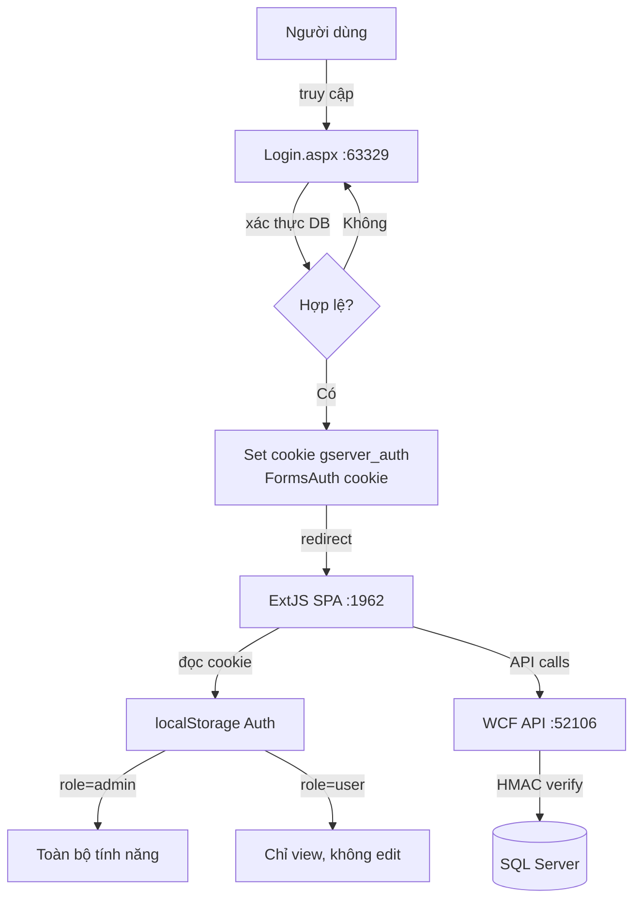

# Tổng hợp kiến thức — Phiên làm việc

Tài liệu này tổng hợp các khái niệm, pattern và quyết định kiến trúc được áp dụng trong hệ thống gServer/gClient.

---

## 1. Page là gì? (ASP.NET WebForms)

**Page** trong ASP.NET WebForms là một file `.aspx` — mỗi file tương ứng một URL, render HTML phía server và trả về cho trình duyệt.

```
/Login.aspx    → màn hình đăng nhập
/Register.aspx → màn hình đăng ký
/Home.aspx     → trang chủ (sau khi đăng nhập)
```

Mỗi page có 3 file đi kèm:

| File | Vai trò |
|---|---|
| `Login.aspx` | Markup HTML (WebForms controls) |
| `Login.aspx.cs` | Code-behind — xử lý logic, event |
| `Login.aspx.designer.cs` | Auto-generated — khai báo controls cho IDE |

**Vòng đời của một Page request:**

```
Trình duyệt GET /Login.aspx
  → IIS → ASP.NET pipeline
  → Page_Load() chạy
  → Server render HTML
  → Trình duyệt nhận HTML đầy đủ
```

> **Khác với ExtJS SPA**: ASP.NET render HTML mới mỗi lần navigate. ExtJS chỉ load một lần, sau đó swap component trong JavaScript.

---

## 2. Module là gì? (ExtJS)

Trong ExtJS, không có khái niệm "module" chính thức — thuật ngữ này dùng để chỉ một **tính năng độc lập** được đóng gói thành một nhóm file:

```
view/admin/
  UserManagementView.js        ← View (UI)
  UserManagementViewController.js ← ViewController (logic)

view/Features/
  FeatureView.js
  FeatureViewController.js
  FeatureStore.js              ← Store (data)
```

Mỗi module trong hệ thống này gồm:

- **View** — định nghĩa giao diện (components, layout)
- **ViewController** — xử lý user interaction (button click, form submit)
- **Store** (tuỳ chọn) — quản lý data (fetch từ API, cache)

Module được kích hoạt khi người dùng click menu → `MainViewController` render đúng `xtype` tương ứng vào content area.

---

## 3. View vs ViewController (ExtJS MVC)

```
MainView (xtype: mainview)
├── NavView
│   └── NavViewController  ← xử lý navigation
└── ContentPanel
    └── [view hiện tại]    ← swap tuỳ menu item
        └── [ViewController riêng của view đó]
```

**Quy tắc phân giải handler:**

Khi một button dùng `handler: 'onSomething'`, ExtJS tìm method này bằng cách **leo lên cây component** (walk up) cho đến khi gặp một ViewController có method đó.

```
Button (handler: 'onBottomViewlogout')
  → BottomView (không có VC riêng)
  → NavView (có NavViewController!) ← dừng ở đây
```

**Bài học thực tế**: Logout button trong `BottomView` phải được xử lý bởi `NavViewController` (không phải `MainViewController`) vì `NavView` là cha gần nhất có ViewController.

---

## 4. SPA vs MPA — Tại sao cần hai server?

| Tiêu chí | ASP.NET (port 63329) | ExtJS (port 1962) |
|---|---|---|
| Loại | MPA — Multi Page App | SPA — Single Page App |
| Mỗi URL | Một file `.aspx`, render server | Không có — một file `index.html` duy nhất |
| Navigate | Trình duyệt load trang mới | JavaScript swap component, URL không đổi |
| Vai trò | Xác thực, redirect | Toàn bộ ứng dụng sau login |

**Kiến trúc được chọn (Option A):**

```
Người dùng truy cập http://localhost:63329/Login.aspx
  → Nhập username/password
  → ASP.NET xác thực → set cookie gserver_auth
  → Redirect sang http://localhost:1962/?loginUrl=...
  → ExtJS đọc cookie → lưu vào localStorage → xoá cookie
  → Render MainView (toàn bộ app)
```

---

## 5. Cookie và xác thực cross-port

**Vấn đề**: ASP.NET chạy port 63329, ExtJS chạy port 1962 — làm sao chia sẻ thông tin đăng nhập?

**Giải pháp**: Cookie trên `localhost` được chia sẻ theo **domain**, không theo port.

```
ASP.NET set cookie:
  Name:     gserver_auth
  Domain:   localhost      ← không có port
  HttpOnly: false          ← JS phía client có thể đọc được
  Expires:  +8 giờ

ExtJS đọc cookie tại localhost:1962:
  → document.cookie → tìm "gserver_auth"
  → base64decode → JSON.parse
  → lưu vào localStorage → xoá cookie ngay
```

**Cấu trúc cookie `gserver_auth`:**

```json
{
  "token":    "eyJ...<HMAC-SHA256 token>",
  "username": "admin",
  "role":     "admin",
  "fullName": "Nguyễn Văn A"
}
```

Cookie được encode bằng `base64(JSON)` để tránh ký tự đặc biệt.

---

## 6. HMAC Token — Xác thực API

Mỗi request gọi WCF API phải kèm token trong header `Authorization`.

**Token được tạo bởi ASP.NET (`TokenHelper.cs`):**

```
payload = base64( "username|role|expiry_unix_timestamp" )
token   = payload + "." + HMAC_SHA256(payload, secret)
```

**WCF API kiểm tra token:**
- Tách `payload` và `signature`
- Tính lại HMAC, so sánh
- Kiểm tra `expiry` chưa quá hạn

**Lưu ý .NET 4.5.1**: Không dùng `DateTimeOffset.ToUnixTimeSeconds()` (chỉ có từ .NET 4.6). Thay bằng:

```csharp
var epoch = new DateTimeOffset(1970, 1, 1, 0, 0, 0, TimeSpan.Zero);
var unixTs = (long)(DateTimeOffset.UtcNow - epoch).TotalSeconds;
```

---

## 7. Role-based Access Control (phân quyền)

Hệ thống có 2 role: `admin` và `user`.

### 7a. Menu filtering (ExtJS)

File `menu.json` khai báo `roles` cho từng mục:

```json
{ "text": "Edit Layers", "xtype": "LayerView", "roles": ["admin"] },
{ "text": "Người dùng",  "xtype": "usermanagement", "roles": ["admin"] },
{ "text": "Map",         "xtype": "mapPanel", "roles": ["admin", "user"] }
```

`MainViewController._filterMenuByRole()` chạy sau khi store load — thu thập node cần xoá trước, sau đó xoá (tránh lỗi khi traverse và modify đồng thời):

```js
var toRemove = [];
store.getRootNode().cascadeBy(function(node) {
    var roles = node.get('roles');
    if (roles && Ext.Array.indexOf(roles, currentRole) < 0) {
        toRemove.push(node);
    }
});
Ext.each(toRemove, function(n) { n.parentNode.removeChild(n); });
```

### 7b. Layers view — ẩn tool theo role

Trong `LayerController.js`, mọi chỗ có chức năng chỉnh sửa đều kiểm tra `gClient.util.Auth.isAdmin()`:

| Tính năng | Admin | User |
|---|---|---|
| Draw toolbar (vẽ Point/Line/Polygon) | Hiện | Ẩn |
| Nút "Thêm Layer" | Hiện | Ẩn |
| Nút pencil (Feature CRUD) | Hiện | Ẩn |
| Nút palette (Style) | Hiện | Ẩn |
| Nút edit (Layer info) | Hiện | Ẩn |
| Nút trash (Xoá layer) | Hiện | Ẩn |
| Nút eye (Hiện/ẩn trên map) | Hiện | Hiện |

---

## 8. WidgetCell — Button trong Grid

ExtJS Modern không hỗ trợ `renderer` trả về HTML với `onclick` string một cách đáng tin cậy. Cách đúng là dùng **`widgetcell`**:

```js
{
    text: 'Thao tác',
    cell: {
        xtype: 'widgetcell',
        widget: {
            xtype: 'container',
            layout: { type: 'hbox', align: 'center' },
            items: [
                { xtype: 'button', text: 'Sửa', handler: 'onEditRow' },
                { xtype: 'button', text: 'Xóa', handler: 'onDeleteRow' }
            ]
        }
    }
}
```

**Lấy record từ button handler trong widgetcell:**

```js
onEditRow: function(btn) {
    var record = btn.up('gridrow').getRecord();
    // record.get('Username'), record.get('FullName'), ...
}
```

---

## 9. Floated Panel (Dialog thay thế)

ExtJS Modern dùng `Ext.Panel` với `floated: true` thay cho `Ext.Dialog` (ít lỗi hơn):

```js
var panel = Ext.create('Ext.Panel', {
    title: 'Sửa người dùng',
    floated: true,
    modal: true,
    centered: true,
    width: 400,
    items: [
        { xtype: 'textfield', itemId: 'fFullName', label: 'Họ tên' }
    ],
    buttons: [
        { text: 'Lưu', handler: function() { /* ... */ } }
    ]
});
panel.show();
```

**Truy cập field bằng `itemId`:**

```js
var val = panel.down('#fFullName').getValue();
```

> Dùng `itemId` + `panel.down('#id')` thay vì `reference` + `lookupReference()` — ít lỗi scope hơn.

---

## 10. initialize() — Lazy evaluation trong ExtJS

**Vấn đề**: Component body (các property như `html`, `title`) được evaluate tại thời điểm **định nghĩa class**, không phải khi render. Nếu data chưa sẵn sàng → undefined/null.

```js
// SAI — Auth chưa được load khi class được parse
{
    xtype: 'component',
    html: gClient.util.Auth.getFullName()  // ← luôn null
}
```

**Đúng**: Dùng `initialize()` override — chạy khi component được tạo instance:

```js
{
    xtype: 'component',
    itemId: 'userInfo'
},
initialize: function() {
    this.callParent(arguments);
    var name = gClient.util.Auth.getFullName() || '';
    this.getComponent('userInfo').setHtml(name);
}
```

---

## 11. webpack-dev-server và proxy

Khi chạy `npm run start`, webpack-dev-server phục vụ ExtJS tại `localhost:1962` và proxy các request API sang WCF:

```js
// webpack.config.js
proxy: {
    '/api': {
        target: 'http://localhost:52106',
        pathRewrite: { '^/api': '' }  // bỏ prefix /api
    }
}
```

**Kết quả**: ExtJS gọi `/api/LayerService.svc/layers` → proxy chuyển thành `http://localhost:52106/LayerService.svc/layers` → WCF xử lý.

Nhờ proxy, ExtJS không cần biết địa chỉ thật của WCF — dễ đổi khi deploy.

---

## 12. Luồng đăng ký tài khoản

```
Register.aspx (form)
  → POST → Register.aspx.cs
  → Validate (username regex, password length, match, uniqueness)
  → HashPassword: salt = Guid.NewGuid(), hash = SHA256(salt + ":" + password)
  → INSERT INTO USERS (Role='user', IsActive=1)
  → Set FormsAuth cookie (session ASP.NET)
  → Set gserver_auth cookie (cho ExtJS)
  → Redirect sang ExtJS (giống Login)
```

Password lưu dạng `salt:base64(SHA256(salt:password))` — không lưu plain text, không thể reverse.

---

## Sơ đồ tổng thể


