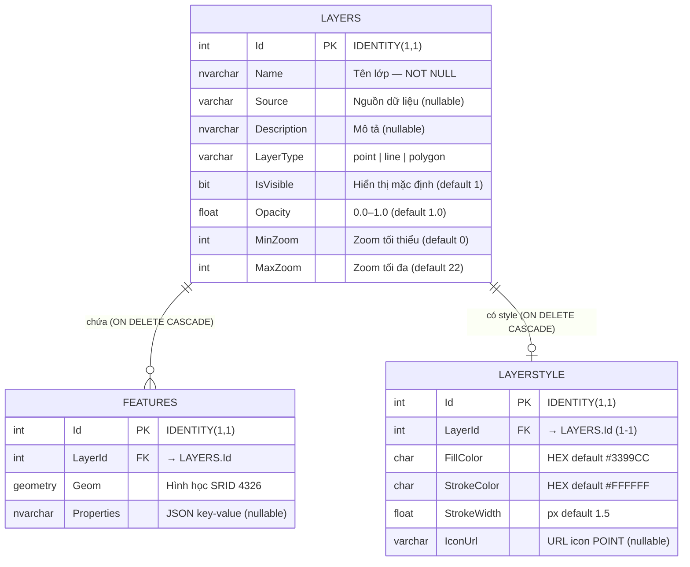

# Cơ sở dữ liệu

## Sơ đồ ERD



---

## Script tạo bảng

```sql
-- ── Lớp bản đồ ──────────────────────────────────────────────────────────
CREATE TABLE LAYERS (
    Id          INT IDENTITY(1,1) PRIMARY KEY,
    Name        NVARCHAR(150) NOT NULL,
    Source      VARCHAR(200)  NULL,
    Description NVARCHAR(200) NULL,
    LayerType   VARCHAR(10)   NOT NULL,   -- 'point' | 'line' | 'polygon'
    IsVisible   BIT           NOT NULL DEFAULT 1,
    Opacity     FLOAT         NOT NULL DEFAULT 1.0
                              CHECK (Opacity >= 0.0 AND Opacity <= 1.0),
    MinZoom     INT           DEFAULT 0,
    MaxZoom     INT           DEFAULT 22
);

-- ── Đối tượng địa lý ────────────────────────────────────────────────────
CREATE TABLE FEATURES (
    Id          INT IDENTITY(1,1) PRIMARY KEY,
    LayerId     INT           NOT NULL,
    Geom        GEOMETRY      NOT NULL,
    Properties  NVARCHAR(MAX) NULL,
    CONSTRAINT FK_Features_Layers
        FOREIGN KEY (LayerId) REFERENCES LAYERS(Id) ON DELETE CASCADE
);

-- Spatial index bao phủ toàn Việt Nam (lon 100–110, lat 8–24)
CREATE SPATIAL INDEX idx_features_geom
ON FEATURES(Geom)
USING GEOMETRY_AUTO_GRID
WITH (BOUNDING_BOX = (100, 8, 110, 24));

-- ── Style hiển thị ──────────────────────────────────────────────────────
CREATE TABLE LAYERSTYLE (
    Id          INT IDENTITY(1,1) PRIMARY KEY,
    LayerId     INT           NOT NULL,
    FillColor   CHAR(10)      NOT NULL DEFAULT '#3399CC',
    StrokeColor CHAR(10)      NOT NULL DEFAULT '#FFFFFF',
    StrokeWidth FLOAT         DEFAULT 1.5,
    IconUrl     VARCHAR(200)  NULL,
    CONSTRAINT FK_LAYERSTYLE_Layers
        FOREIGN KEY (LayerId) REFERENCES LAYERS(Id) ON DELETE CASCADE
);
```

---

## Chi tiết từng bảng

### LAYERS — Lớp bản đồ

Lưu metadata của mỗi chủ đề địa lý (ranh giới tỉnh, tuyến đường, điểm trạm…).

| Cột | Kiểu | Ghi chú |
|---|---|---|
| `Name` | `NVARCHAR(150)` | Tên hiển thị — duy nhất trong hệ thống |
| `LayerType` | `VARCHAR(10)` | `point` / `line` / `polygon` — quyết định OL style |
| `IsVisible` | `BIT` | `1` = hiển thị mặc định khi mở trang |
| `Opacity` | `FLOAT` | 0.0–1.0, có CHECK constraint |
| `MinZoom / MaxZoom` | `INT` | Phạm vi zoom OL hiển thị layer (0–22) |

### FEATURES — Đối tượng địa lý

| Cột | Kiểu | Ghi chú |
|---|---|---|
| `LayerId` | `INT FK` | Cascade delete khi xóa layer |
| `Geom` | `GEOMETRY` | Hình học phẳng SRID 4326 (lon trước, lat sau) |
| `Properties` | `NVARCHAR(MAX)` | JSON key-value — `{"ten":"Hà Nội","danso":8000000}` |

### LAYERSTYLE — Style hiển thị

Mỗi layer có **tối đa 1** style. Cascade delete khi xóa layer.

| Cột | Mặc định | Dùng cho |
|---|---|---|
| `FillColor` | `#3399CC` | Màu nền Polygon · Fill cho Circle (POINT) |
| `StrokeColor` | `#FFFFFF` | Màu viền Polygon · LineString · Circle |
| `StrokeWidth` | `1.5` | Độ dày viền (px) |
| `IconUrl` | `null` | URL icon PNG/SVG — **chỉ dùng cho POINT** |

!!! tip "Style theo loại geometry"
    - **POINT** có `IconUrl` → `ol.style.Icon`
    - **POINT** không có `IconUrl` → `ol.style.Circle` (fill + stroke)
    - **POLYGON** → `ol.style.Fill` + `ol.style.Stroke`
    - **LINESTRING** → chỉ `ol.style.Stroke`

---

## Truy vấn thường dùng

=== "Lấy WKT feature"

    ```sql
    SELECT Id, LayerId, Geom.STAsText() AS GeomWkt, Properties
    FROM   FEATURES
    WHERE  LayerId = @LayerId;
    ```

=== "Chèn feature mới"

    ```sql
    INSERT INTO FEATURES (LayerId, Geom, Properties)
    VALUES (
        @LayerId,
        geometry::STGeomFromText(@GeomWkt, 4326),
        @Properties
    );
    ```

=== "Identify tại tọa độ"

    ```sql
    -- Tìm feature giao với điểm lon/lat (buffer 5m)
    DECLARE @pt  GEOMETRY = geometry::STGeomFromText(
        'POINT(' + @lon + ' ' + @lat + ')', 4326);
    DECLARE @buf GEOMETRY = @pt.STBuffer(5);

    SELECT f.Id, f.LayerId, f.Geom.STAsText() AS GeomWkt, f.Properties
    FROM   FEATURES f
    WHERE  f.Geom.STIntersects(@buf) = 1;
    ```

=== "Batch theo danh sách ID"

    ```sql
    SELECT Id, LayerId, Geom.STAsText() AS GeomWkt, Properties
    FROM   FEATURES
    WHERE  Id IN (1, 2, 3, 4);
    ```

=== "Import từ bảng cũ"

    ```sql
    -- Đóng gói thuộc tính thành JSON bằng FOR JSON
    INSERT INTO FEATURES (LayerId, Geom, Properties)
    SELECT
        @NewLayerId,
        [Geom_geom],
        (SELECT [commune],[district],[province],[lat],[lng]
         FOR JSON PATH, WITHOUT_ARRAY_WRAPPER) AS Properties
    FROM [gServer_dev_DB].[dbo].[DiaPhanTinhCu]
    WHERE [Geom_geom] IS NOT NULL;
    ```

---

## Định dạng WKT

Tọa độ theo thứ tự **kinh độ (X) · vĩ độ (Y)**, SRID 4326.

| Loại | WKT mẫu |
|---|---|
| Point | `POINT(105.8342 21.0278)` |
| LineString | `LINESTRING(105.0 21.0, 106.0 21.5, 107.0 22.0)` |
| Polygon | `POLYGON((105.0 21.0, 106.0 21.0, 106.0 22.0, 105.0 22.0, 105.0 21.0))` |

!!! warning "Polygon phải đóng vòng"
    Điểm cuối phải trùng điểm đầu: `POLYGON((A, B, C, D, A))`.

!!! warning "GEOMETRY vs GEOGRAPHY"
    Project dùng `GEOMETRY` (phẳng), không phải `GEOGRAPHY` (cầu).
    `STAsText()` trả đúng WKT lon/lat. Đừng dùng `STGeographyFromText`.

---

## Spatial Index

```sql
CREATE SPATIAL INDEX idx_features_geom
ON FEATURES(Geom)
USING GEOMETRY_AUTO_GRID
WITH (BOUNDING_BOX = (100, 8, 110, 24));
-- lon: 100 → 110  |  lat: 8 → 24  (toàn lãnh thổ Việt Nam)
```

Tăng tốc truy vấn `STIntersects()` trong endpoint `/identify`.
Rebuild sau khi import dữ liệu lớn:

```sql
ALTER INDEX idx_features_geom ON FEATURES REBUILD;
```
