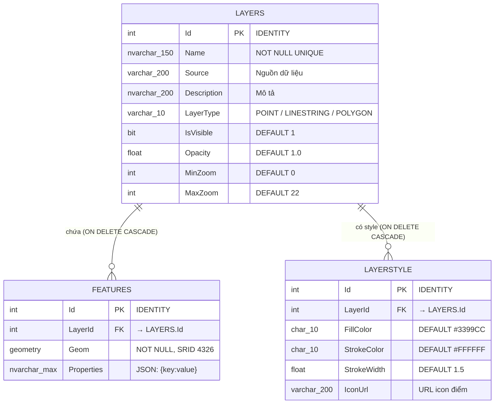

# Cơ sở dữ liệu

## ERD — Sơ đồ quan hệ



---

## Bảng LAYERS

Lưu metadata của mỗi lớp bản đồ. Một layer = một chủ đề địa lý (ranh giới tỉnh, tuyến đường, điểm bệnh viện...).

```sql
CREATE TABLE LAYERS (
    Id          INT IDENTITY(1,1) PRIMARY KEY,
    Name        NVARCHAR(150) NOT NULL,
    Source      VARCHAR(200),
    Description NVARCHAR(200),
    LayerType   VARCHAR(10),        -- 'POINT' | 'LINESTRING' | 'POLYGON'
    IsVisible   BIT DEFAULT 1,
    Opacity     FLOAT DEFAULT 1.0,
    MinZoom     INT DEFAULT 0,
    MaxZoom     INT DEFAULT 22,
    CONSTRAINT uq_layer_name UNIQUE (Name)
);
```

| Cột | Ghi chú |
|---|---|
| `LayerType` | Chỉ nhận `'POINT'`, `'LINESTRING'`, `'POLYGON'` (chữ HOA) |
| `Opacity` | `0.0` = trong suốt, `1.0` = đục hoàn toàn |
| `IsVisible` | `1` = hiện mặc định khi load trang |

---

## Bảng FEATURES

Lưu hình học thực tế (geometry) và thuộc tính (properties) của từng đối tượng địa lý.

```sql
CREATE TABLE FEATURES (
    Id          INT IDENTITY(1,1) PRIMARY KEY,
    LayerId     INT NOT NULL,
    Geom        GEOMETRY NOT NULL,
    Properties  NVARCHAR(MAX),      -- JSON string: {"ten":"BV Bạch Mai","loai":"bệnh viện"}
    CONSTRAINT fk_features_layer
        FOREIGN KEY (LayerId) REFERENCES LAYERS(Id) ON DELETE CASCADE
);
```

### Thao tác với GEOMETRY

```sql
-- Lưu WKT vào DB
INSERT INTO FEATURES (LayerId, Geom, Properties)
VALUES (
    @LayerId,
    geometry::STGeomFromText(@GeomWkt, 4326),   -- WKT → GEOMETRY
    @PropertiesJson
);

-- Đọc WKT từ DB
SELECT Id,
       Geom.STAsText() AS GeomWkt,              -- GEOMETRY → WKT
       Properties
FROM FEATURES
WHERE LayerId = @LayerId;

-- Truy vấn không gian (Identify)
SELECT f.Id, f.Geom.STAsText() AS GeomWkt, f.Properties
FROM FEATURES f
WHERE f.Geom.STIntersects(
    geometry::STGeomFromText(@PointWkt, 4326).STBuffer(0.00005)
) = 1;
```

### Spatial Index

```sql
CREATE SPATIAL INDEX idx_features_geom
ON FEATURES(Geom)
USING GEOMETRY_AUTO_GRID
WITH (
    BOUNDING_BOX = (100, 8, 110, 24),   -- Bao phủ toàn bộ lãnh thổ Việt Nam
    CELLS_PER_OBJECT = 16
);
```

!!! warning "Giới hạn Spatial Index"
    Query với tọa độ **ngoài bounding box** `(100°E, 8°N, 110°E, 24°N)` sẽ không dùng được index → chậm.  
    Nếu mở rộng phạm vi địa lý, cần rebuild index với bbox lớn hơn.

---

## Bảng LAYERSTYLE

Lưu thông tin hiển thị (màu sắc, độ dày viền) cho mỗi layer.

```sql
CREATE TABLE LAYERSTYLE (
    Id          INT IDENTITY(1,1) PRIMARY KEY,
    LayerId     INT NOT NULL,
    FillColor   CHAR(10) DEFAULT '#3399CC',
    StrokeColor CHAR(10) DEFAULT '#FFFFFF',
    StrokeWidth FLOAT DEFAULT 1.5,
    IconUrl     VARCHAR(200),
    CONSTRAINT fk_style_layer
        FOREIGN KEY (LayerId) REFERENCES LAYERS(Id) ON DELETE CASCADE
);
```

| Cột | Mặc định | Dùng cho |
|---|---|---|
| `FillColor` | `#3399CC` | Màu nền Polygon |
| `StrokeColor` | `#FFFFFF` | Màu viền Polygon, màu đường LineString |
| `StrokeWidth` | `1.5` | Độ dày viền (px) |
| `IconUrl` | `NULL` | URL icon SVG/PNG cho Point |

---

## Properties — Lưu trữ thuộc tính động

Mỗi feature có tập thuộc tính riêng (không có schema cố định). Lưu dưới dạng **JSON string** trong cột `NVARCHAR(MAX)`.

```json
{ "ten": "BV Bạch Mai", "loai": "bệnh viện", "giuong": 1900 }
```

**C# serialize/deserialize:**
```csharp
// Lưu
string json = JsonConvert.SerializeObject(properties);

// Đọc
var dict = JsonConvert.DeserializeObject<Dictionary<string, object>>(json);

// WCF có thể serialize Dictionary thành [{Key, Value}] array
// FE xử lý cả 2 format
```

!!! info "Lý do dùng JSON thay vì bảng riêng"
    Mỗi layer có schema thuộc tính khác nhau (layer tỉnh có `ten_tinh`, layer bệnh viện có `giuong`...).  
    Dùng JSON tránh phải ALTER TABLE mỗi khi thêm layer mới.

---

## SRID và hệ tọa độ

| Thông số | Giá trị |
|---|---|
| **SRID** | 4326 (WGS84) |
| **Kiểu SQL** | `GEOMETRY` (không phải `GEOGRAPHY`) |
| **Tọa độ** | Longitude trước, Latitude sau |
| **Đơn vị** | Độ thập phân (decimal degrees) |

```
POINT (105.845 21.028)   ← lon=105.845, lat=21.028 (Hà Nội)
```

!!! note "GEOMETRY vs GEOGRAPHY"
    Dùng `GEOMETRY` (phẳng) thay vì `GEOGRAPHY` (cầu) do tính đơn giản trong xử lý.  
    Sai số tính toán khoảng cách có thể xảy ra với vùng rộng, nhưng chấp nhận được cho phạm vi Việt Nam.
