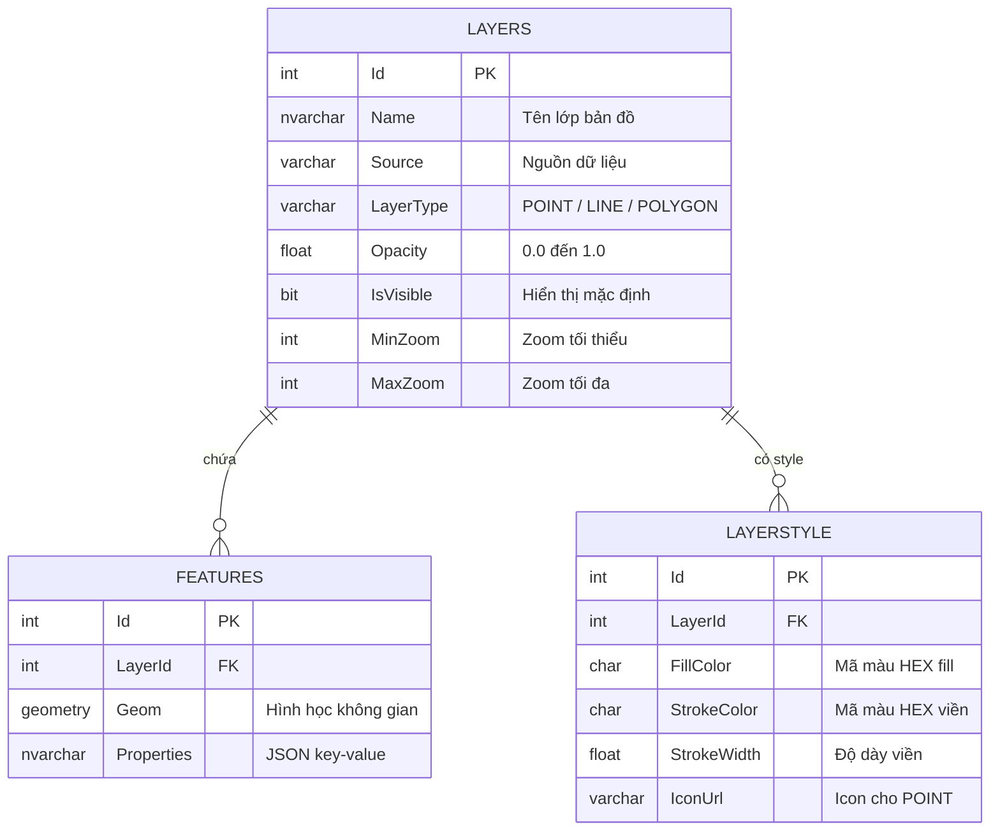

# Cơ sở dữ liệu

## Sơ đồ ERD



## Chi tiết từng bảng

### LAYERS — Lớp bản đồ

Lưu metadata của mỗi lớp dữ liệu địa lý. Một layer tương ứng với một chủ đề (ranh giới tỉnh, tuyến đường, điểm trạm...).

| Cột | Kiểu | Ghi chú |
|---|---|---|
| `LayerType` | `VARCHAR(10)` | Chỉ nhận `POINT`, `LINE`, `POLYGON` |
| `Opacity` | `FLOAT` | CHECK: 0.0 ≤ Opacity ≤ 1.0 |
| `MinZoom / MaxZoom` | `INT` | Phạm vi zoom hiển thị (0–22) |

### FEATURES — Đối tượng địa lý

Lưu hình học thực tế của từng đối tượng. Cột `Geom` kiểu `GEOMETRY` của SQL Server.

```sql
-- Ví dụ truy vấn lấy WKT
SELECT Id, Geom.STAsText() AS GeomWkt, Properties
FROM FEATURES
WHERE LayerId = @LayerId
```

!!! warning "Lưu ý kiểu dữ liệu"
    SQL Server dùng `GEOMETRY` (phẳng, tọa độ mét), không phải `GEOGRAPHY` (cầu, tọa độ độ). Dữ liệu lưu theo EPSG:4326 (lon/lat) nhưng STAsText() vẫn trả về đúng WKT.

### Spatial Index

```sql
CREATE SPATIAL INDEX idx_features_geom
ON FEATURES(Geom)
USING GEOMETRY_AUTO_GRID
WITH (BOUNDING_BOX = (100, 8, 110, 24));
-- Bao phủ toàn bộ lãnh thổ Việt Nam
```

Spatial Index giúp tăng tốc truy vấn `STIntersects()` khi lọc feature theo vùng nhìn của bản đồ.

### LAYERSTYLE — Style hiển thị

| Cột | Giá trị mặc định | Dùng cho |
|---|---|---|
| `FillColor` | `#3399CC` | Màu nền polygon |
| `StrokeColor` | `#FFFFFF` | Màu viền |
| `StrokeWidth` | `1.5` | Độ dày viền |
| `IconUrl` | null | URL icon cho điểm (POINT) |
