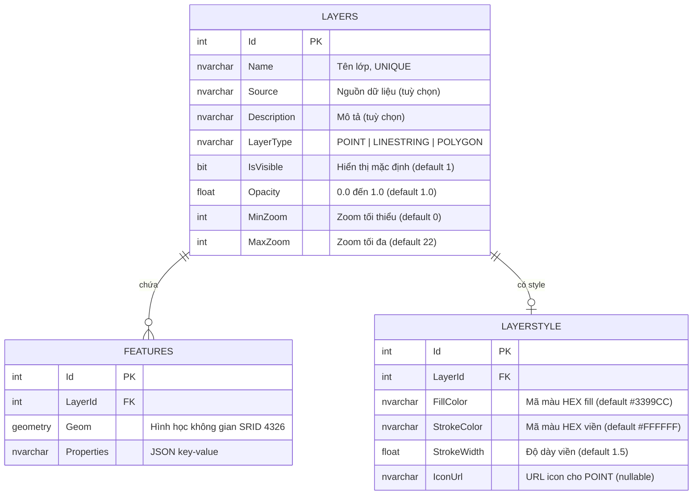

# Cơ sở dữ liệu

## Sơ đồ ERD



## Script tạo bảng

```sql
-- Lớp bản đồ
CREATE TABLE LAYERS (
    Id          INT IDENTITY(1,1) PRIMARY KEY,
    Name        NVARCHAR(255) NOT NULL UNIQUE,
    Source      NVARCHAR(500) NULL,
    Description NVARCHAR(MAX) NULL,
    LayerType   NVARCHAR(50)  NOT NULL DEFAULT 'POINT',
    IsVisible   BIT           NOT NULL DEFAULT 1,
    Opacity     FLOAT         NOT NULL DEFAULT 1.0,
    MinZoom     INT           NOT NULL DEFAULT 0,
    MaxZoom     INT           NOT NULL DEFAULT 22
);

-- Đối tượng không gian
CREATE TABLE FEATURES (
    Id         INT IDENTITY(1,1) PRIMARY KEY,
    LayerId    INT           NOT NULL REFERENCES LAYERS(Id) ON DELETE CASCADE,
    Geom       GEOMETRY      NULL,
    Properties NVARCHAR(MAX) NULL
);

-- Style hiển thị
CREATE TABLE LAYERSTYLE (
    Id          INT IDENTITY(1,1) PRIMARY KEY,
    LayerId     INT           NOT NULL REFERENCES LAYERS(Id) ON DELETE CASCADE,
    FillColor   NVARCHAR(50)  NOT NULL DEFAULT '#3399CC',
    StrokeColor NVARCHAR(50)  NOT NULL DEFAULT '#FFFFFF',
    StrokeWidth FLOAT         NOT NULL DEFAULT 1.5,
    IconUrl     NVARCHAR(500) NULL
);
```

## Chi tiết từng bảng

### LAYERS — Lớp bản đồ

Lưu metadata của mỗi chủ đề địa lý (ranh giới tỉnh, tuyến đường, điểm trạm...).

| Cột | Kiểu | Ràng buộc |
|---|---|---|
| `Name` | `NVARCHAR(255)` | UNIQUE — không trùng tên layer |
| `LayerType` | `NVARCHAR(50)` | Chỉ nhận `POINT`, `LINESTRING`, `POLYGON` |
| `Opacity` | `FLOAT` | 0.0 ≤ value ≤ 1.0 |
| `MinZoom / MaxZoom` | `INT` | Phạm vi zoom hiển thị (0–22) |

### FEATURES — Đối tượng địa lý

Lưu hình học của từng đối tượng. Cột `Geom` kiểu `GEOMETRY` SQL Server, SRID 4326.

```sql
-- Truy vấn lấy WKT
SELECT Id, LayerId, Geom.STAsText() AS GeomWkt, Properties
FROM   FEATURES
WHERE  LayerId = @LayerId

-- Chèn feature mới
INSERT INTO FEATURES (LayerId, Geom, Properties)
VALUES (
    @LayerId,
    geometry::STGeomFromText(@GeomWkt, 4326),
    @Properties
)
```

!!! warning "GEOMETRY vs GEOGRAPHY"
    Project dùng `GEOMETRY` (phẳng, đơn vị mét nội bộ), không phải `GEOGRAPHY` (cầu).  
    Dữ liệu nhập vào theo tọa độ lon/lat (EPSG:4326). `STAsText()` trả về đúng WKT.

### Spatial Index

```sql
-- Tạo spatial index cho truy vấn STIntersects (identify)
CREATE SPATIAL INDEX idx_features_geom
ON FEATURES(Geom)
USING GEOMETRY_AUTO_GRID
WITH (BOUNDING_BOX = (100, 8, 110, 24));
-- Bao phủ toàn bộ lãnh thổ Việt Nam (lon 100–110, lat 8–24)
```

Spatial Index tăng tốc đáng kể truy vấn `STIntersects()` trong endpoint `/identify`.

### LAYERSTYLE — Style hiển thị

| Cột | Giá trị mặc định | Dùng cho |
|---|---|---|
| `FillColor` | `#3399CC` | Màu nền polygon |
| `StrokeColor` | `#FFFFFF` | Màu viền |
| `StrokeWidth` | `1.5` | Độ dày viền (px) |
| `IconUrl` | `null` | URL icon PNG/SVG cho POINT layer |

## Truy vấn ví dụ

### Identify — tìm feature theo tọa độ

```sql
-- Tìm tất cả feature giao với điểm (lon, lat), buffer 5m
DECLARE @point GEOMETRY = geometry::STGeomFromText('POINT(@lon @lat)', 4326);
DECLARE @buffer GEOMETRY = @point.STBuffer(5);

SELECT f.Id, f.LayerId, f.Geom.STAsText() AS GeomWkt, f.Properties
FROM   FEATURES f
WHERE  f.Geom.STIntersects(@buffer) = 1;
```

### Batch — lấy nhiều feature theo danh sách ID

```sql
SELECT Id, LayerId, Geom.STAsText() AS GeomWkt, Properties
FROM   FEATURES
WHERE  Id IN (1, 2, 3, 4);
```
