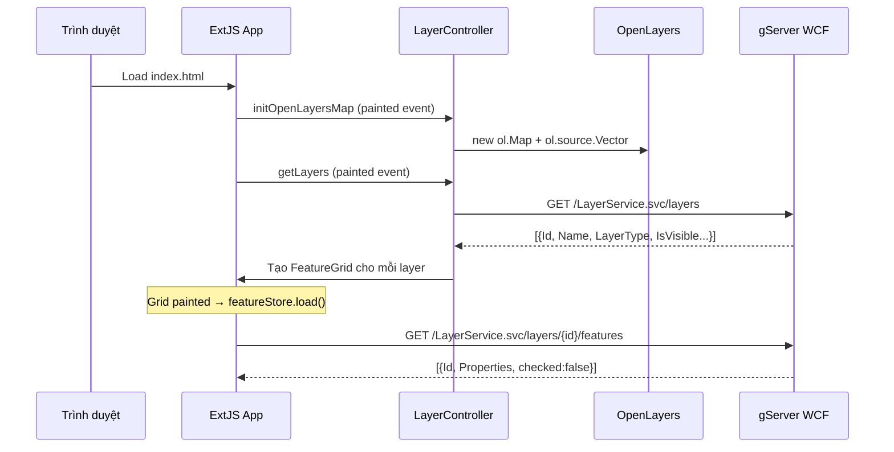
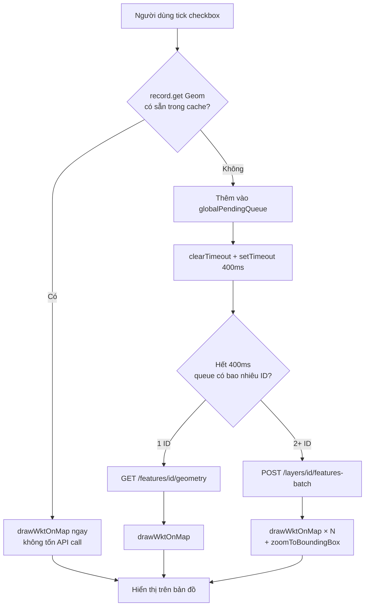
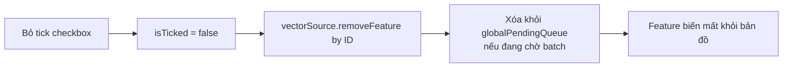
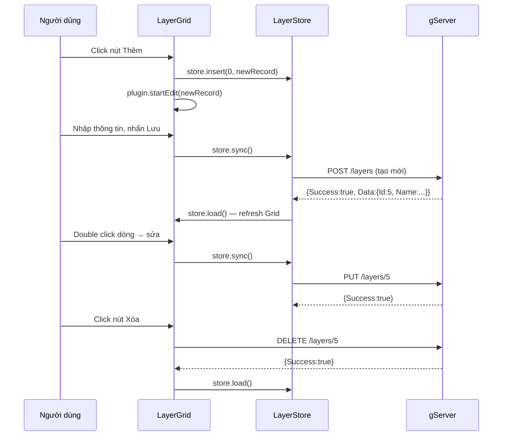
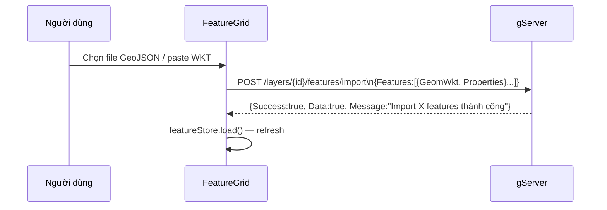
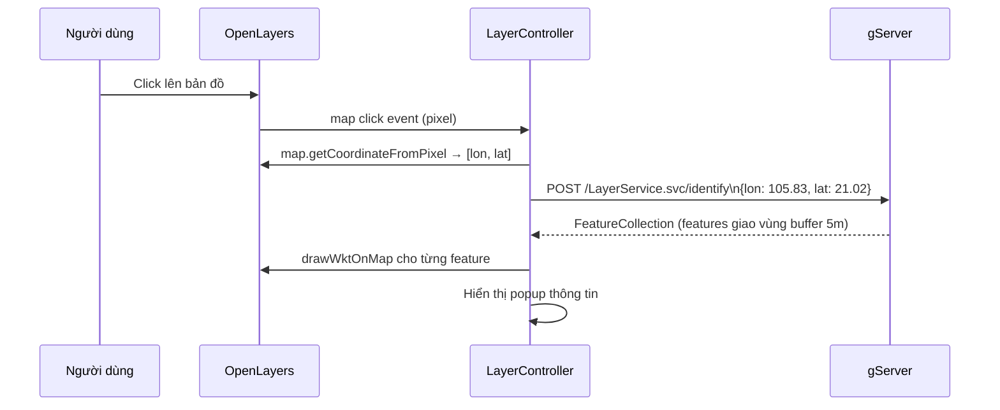

# Luồng dữ liệu

## Luồng khởi tạo bản đồ

## Luồng bật feature lên bản đồ

## Luồng tắt feature

## Luồng CRUD Layer

## Luồng Import Feature

## Luồng Identify

## Tối ưu hiệu năng

| Vấn đề | Giải pháp |
|---|---|
| N request khi tick nhanh | Debounce 400ms + gom batch |
| Gọi API lại khi tick cùng feature | Cache `Geom` vào Ext record |
| Re-render khi cập nhật cache | `record.set('Geom', wkt, {silent: true})` |
| Bản đồ không vừa vùng mới | `zoomToBoundingBox` sau mỗi batch response |
| Identify chậm trên bảng lớn | Spatial Index `GEOMETRY_AUTO_GRID` |
