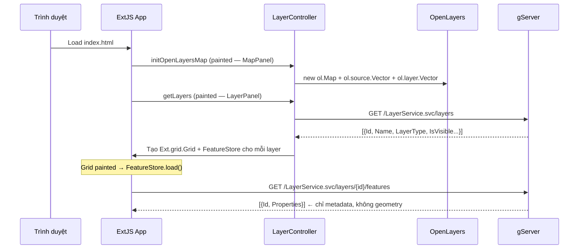
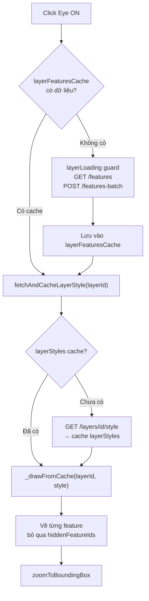
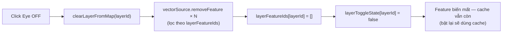
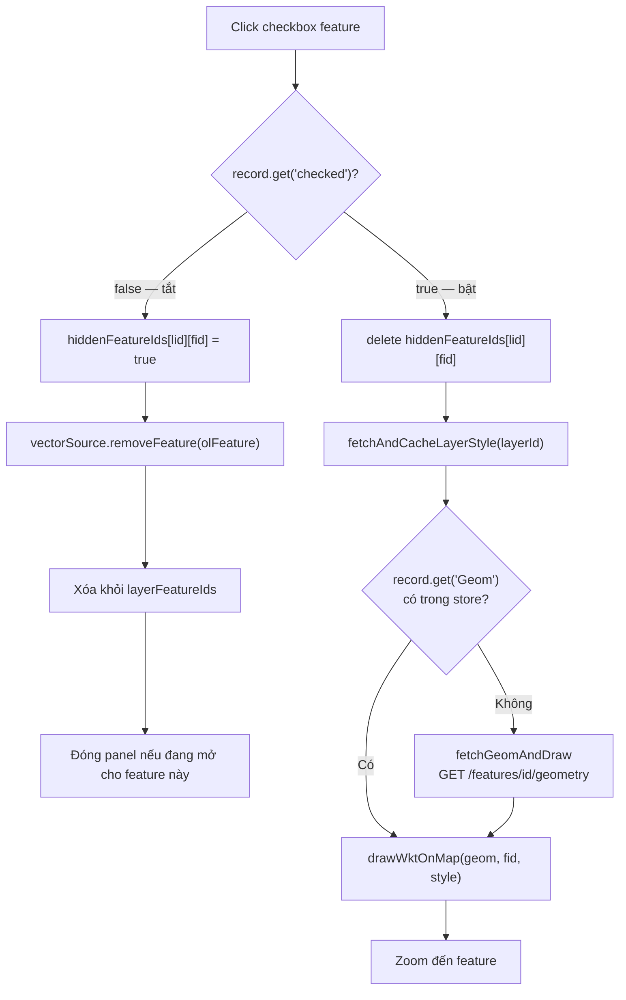
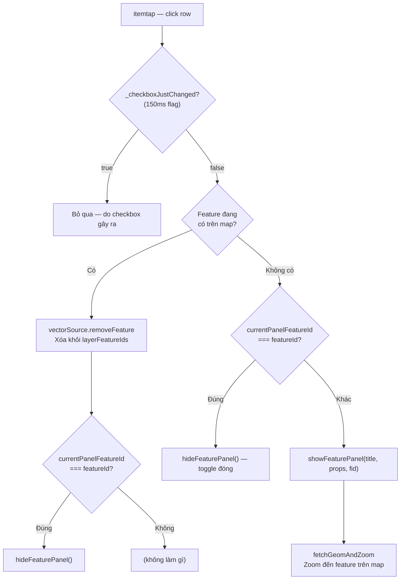
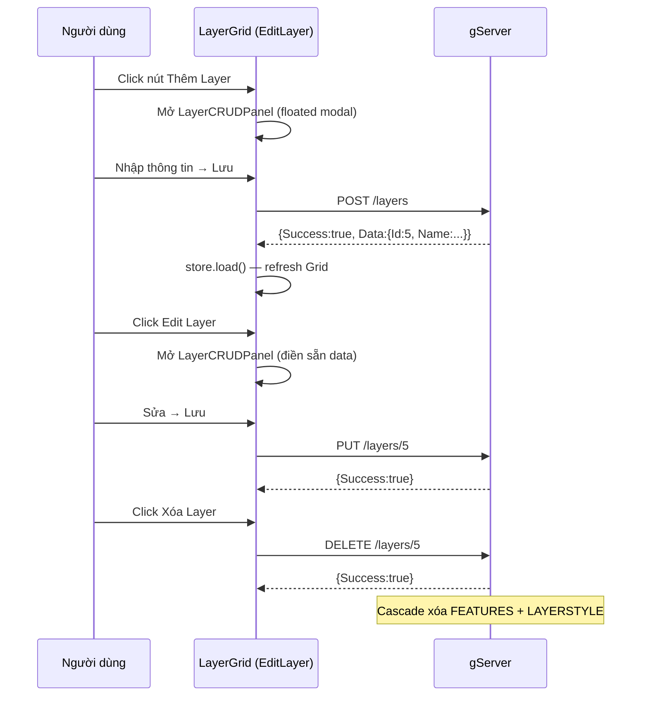
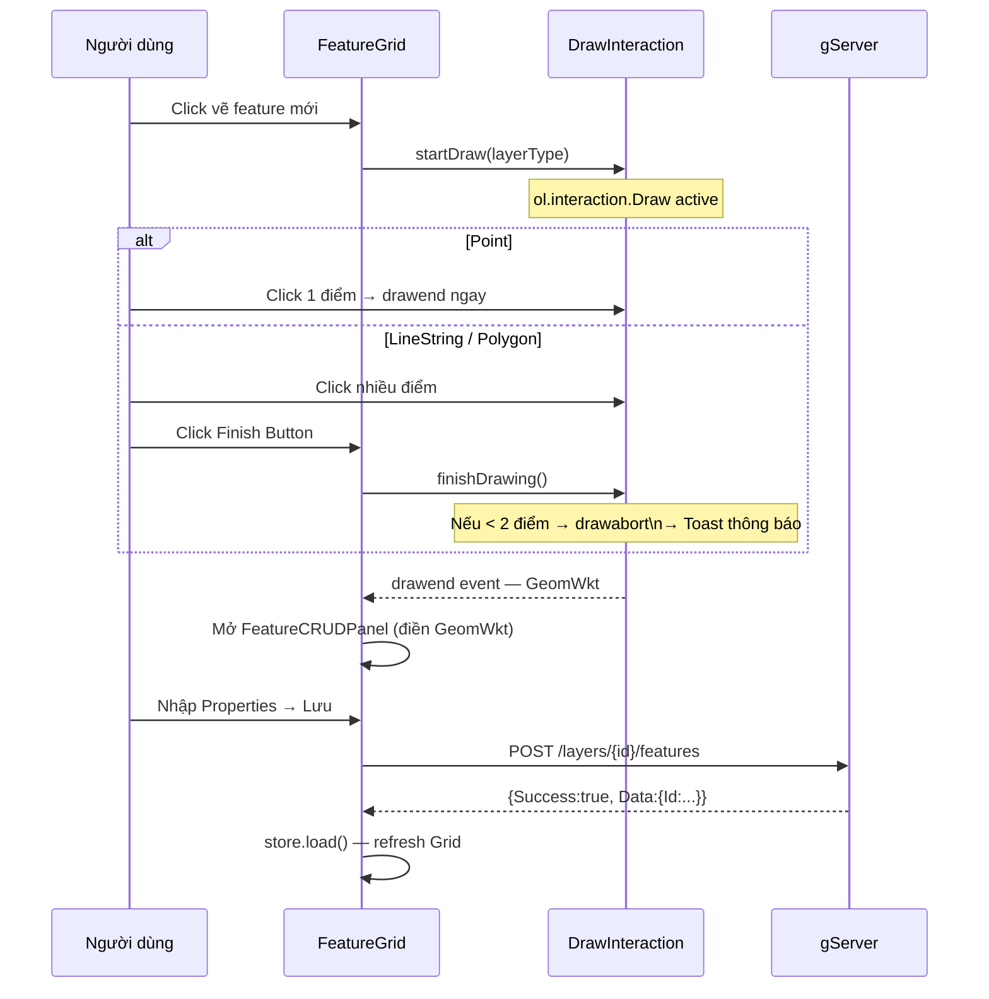
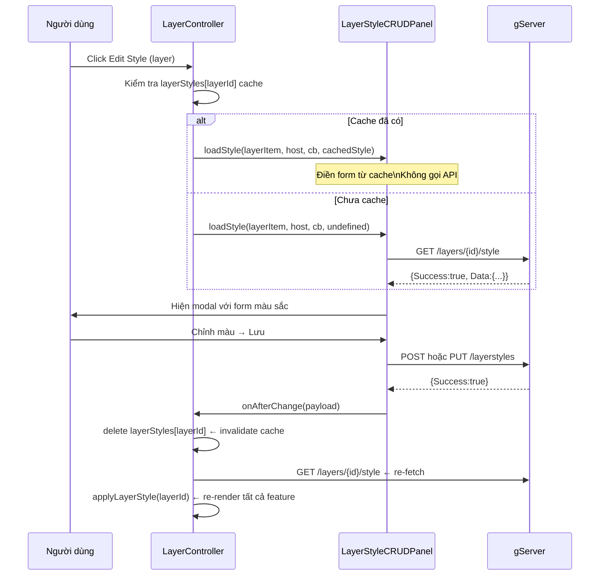

# Luồng dữ liệu

## 1. Khởi tạo bản đồ

---

## 2. Bật layer (eye toggle)

---

## 3. Tắt layer (eye toggle)

---

## 4. Bật/tắt feature riêng lẻ (checkbox)

---

## 5. Click row feature (itemtap)

---

## 6. Luồng CRUD Layer

---

## 7. Luồng CRUD Feature

---

## 8. Luồng Edit Style

