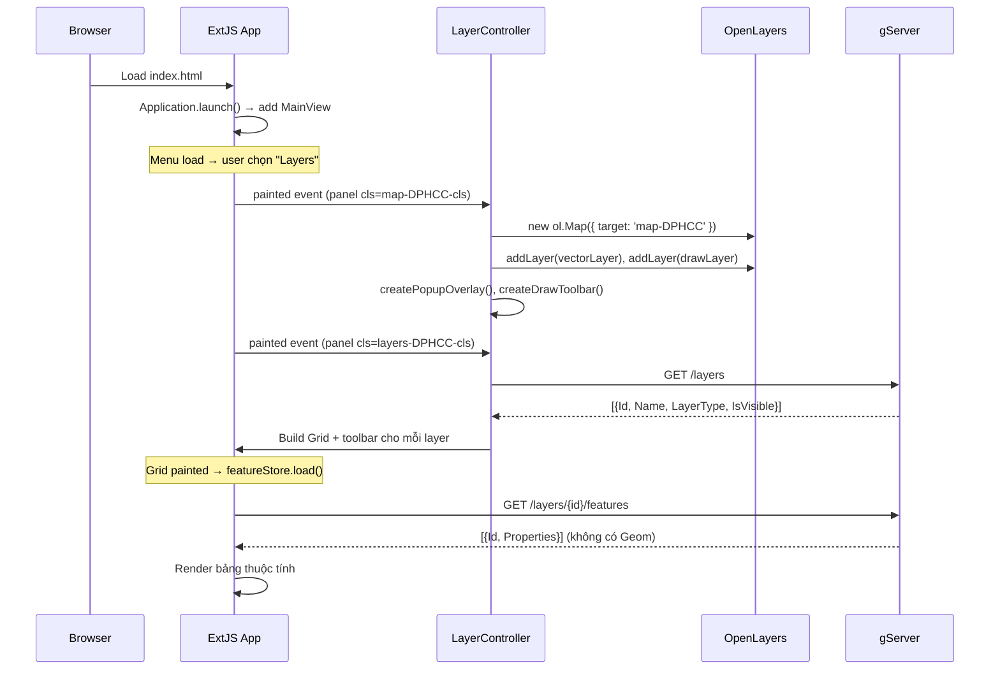
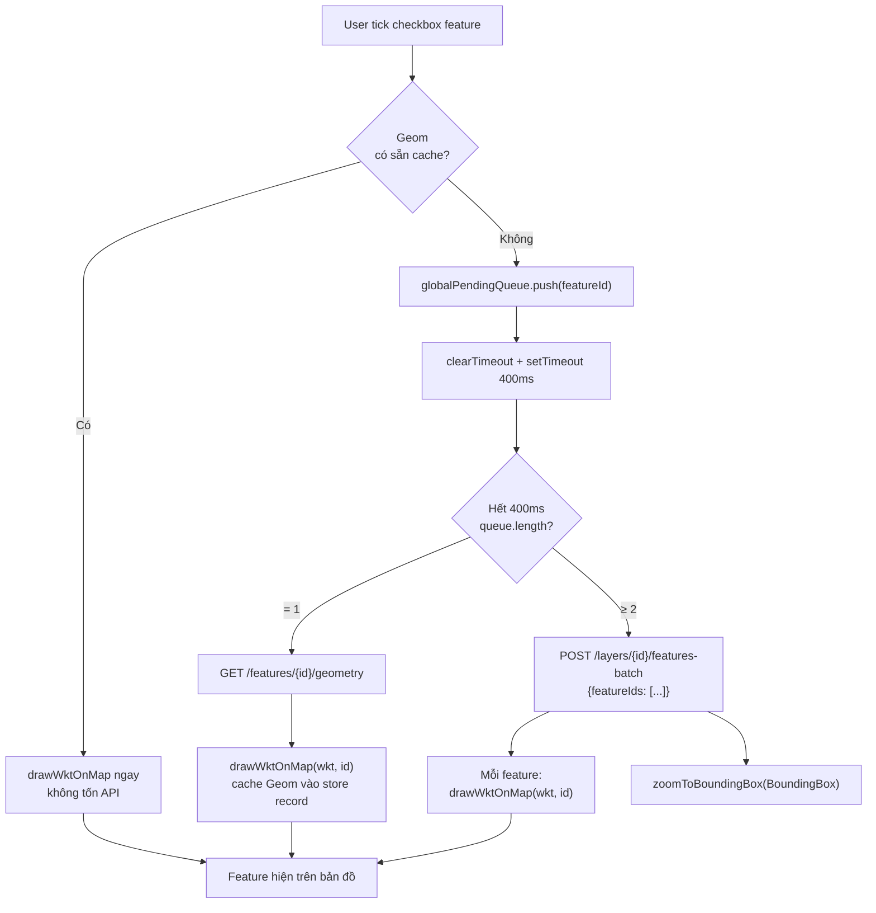
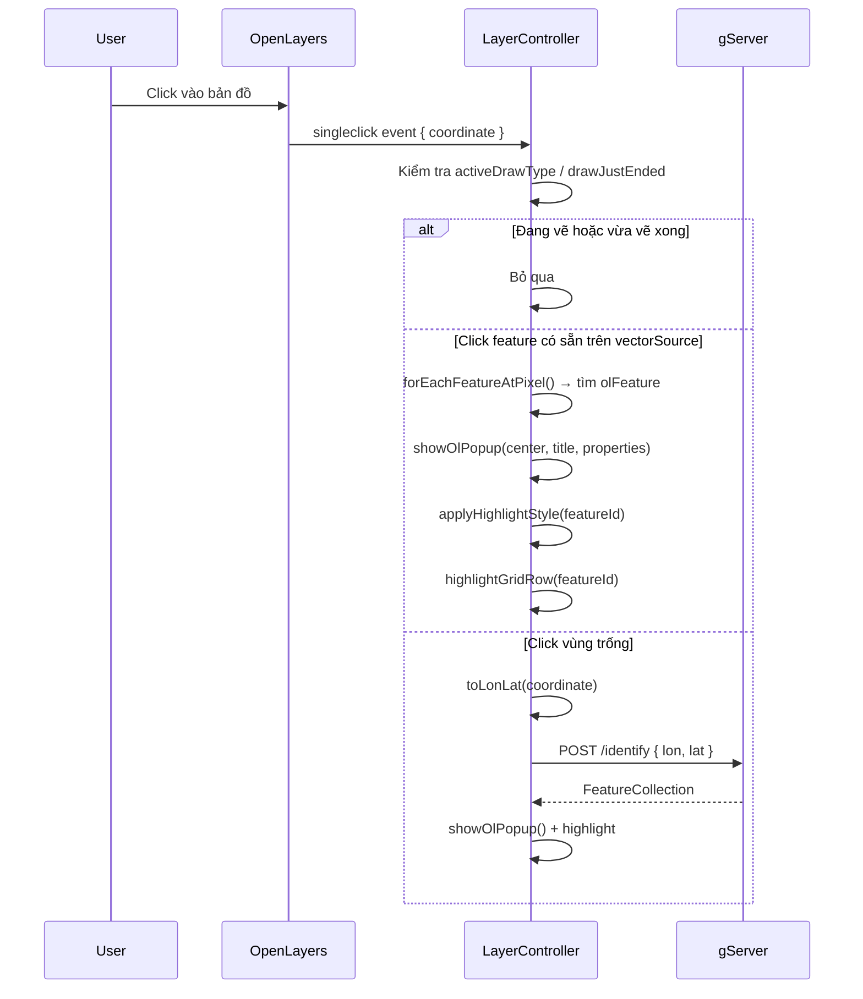
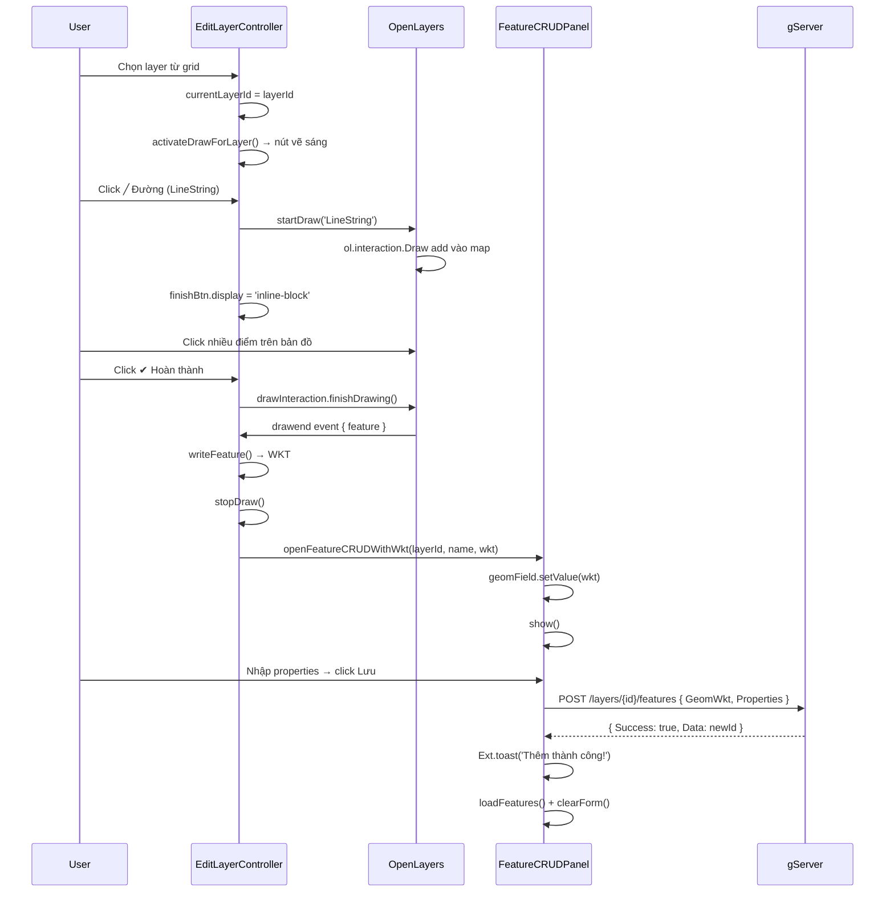
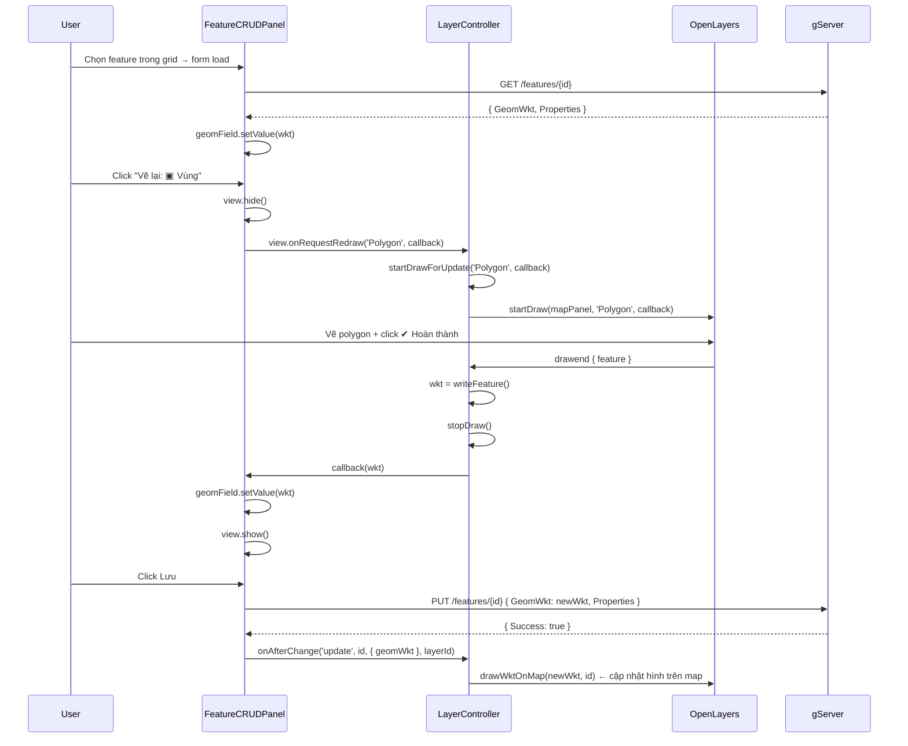
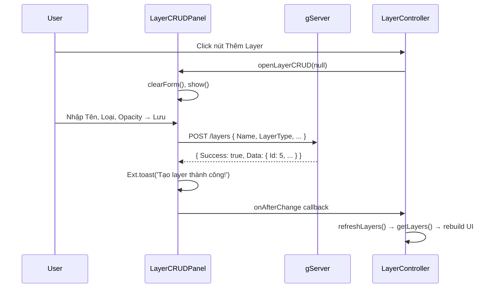

# Luồng dữ liệu

## 1. Khởi tạo ứng dụng

---

## 2. Bật feature lên bản đồ (Debounce + Batch)

---

## 3. Click bản đồ — Identify

---

## 4. Thêm Feature mới bằng vẽ (trang Edit Layers)

---

## 5. Sửa Geometry Feature (Vẽ lại)

---

## 6. CRUD Layer

---

## 7. Tối ưu hiệu năng

| Vấn đề | Giải pháp |
|---|---|
| N request khi tick nhanh nhiều feature | Debounce 400ms + gom thành 1 batch request |
| Gọi API lại cho feature đã có Geom | Cache `Geom` vào store record (`silent: true`), check trước khi request |
| Re-render grid khi set cache | `record.set('Geom', wkt, { silent: true })` — không trigger update event |
| Map không vừa vùng mới | `zoomToBoundingBox(BoundingBox)` sau mỗi batch |
| Point draw kích hoạt singleclick | Flag `drawJustEnded = true`, clear sau 350ms |
| IIS Express port bị giữ | Kill process: `Stop-Process -Name iisexpress -Force` |
