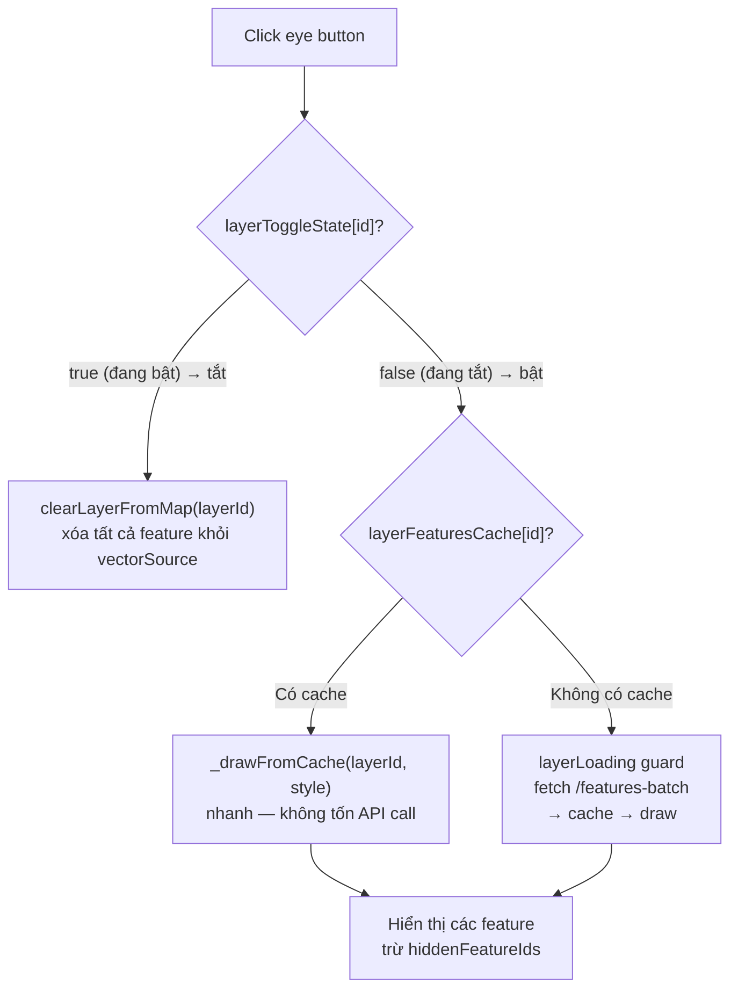
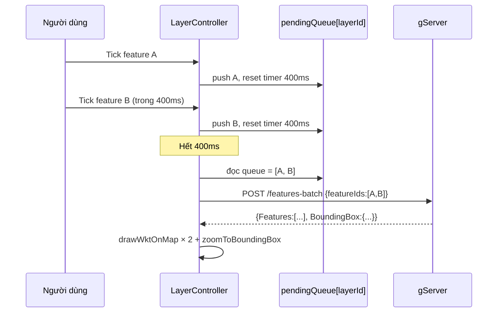

# Cơ chế nâng cao — Frontend

## 1. Lazy Style Cache

Style của layer được fetch **lười** — chỉ lấy khi cần (lần đầu bật layer,
checkbox, row tap, edit style). Kết quả được cache để các lần sau không gọi API.

```
layerStyles[layerId]:
  undefined  → chưa fetch lần nào
  null       → đã fetch nhưng layer không có style
  { obj }    → đã fetch, đây là style
```

### fetchAndCacheLayerStyle

```js
fetchAndCacheLayerStyle: function(layerId, callback) {
    var me = this;

    // Đã có trong cache → dùng luôn
    if (me.layerStyles[layerId] !== undefined) {
        callback(me.layerStyles[layerId]);
        return;
    }

    // Chưa có → gọi API
    Ext.Ajax.request({
        url: apiHost + '/LayerStyle.svc/layers/' + layerId + '/style',
        success: function(res) {
            var result = Ext.decode(res.responseText);
            me.layerStyles[layerId] = (result && result.Success && result.Data)
                ? result.Data
                : null;
            callback(me.layerStyles[layerId]);
        },
        failure: function() {
            me.layerStyles[layerId] = null;
            callback(null);
        }
    });
}
```

### Invalidate cache sau khi save style

```js
// Sau khi LayerStyleCRUD save thành công:
delete me.layerStyles[layerId];       // xóa cache cũ
me.fetchAndCacheLayerStyle(layerId, function(newStyle) {
    me.applyLayerStyle(layerId);      // re-render tất cả feature trên map
});
```

---

## 2. hiddenFeatureIds — Tắt feature riêng lẻ

`hiddenFeatureIds` lưu danh sách feature mà người dùng đã **chủ động uncheck**.
Dùng để phân biệt "chưa hiển thị lần nào" với "người dùng đã tắt".

```
hiddenFeatureIds[layerId][featureId] = true  → feature này đang bị tắt
(key không tồn tại)                          → feature nên hiển thị bình thường
```

!!! warning "Tại sao không dùng `record.get('checked')`?"
    `checked` mặc định là `false` trong FeatureModel (chưa bật).
    Nếu dùng `checked === false` để skip khi draw, eye toggle bật lại sẽ
    không hiện bất kỳ feature nào vì tất cả đang `checked = false`.
    `hiddenFeatureIds` chỉ có giá trị khi người dùng thực sự uncheck.

### handleFeatureToggle (checkbox)

```js
handleFeatureToggle: function(layerId, record) {
    var me        = this;
    var featureId = record.getId();

    // Flag 150ms để onFeatureRowTap không re-fire sau checkbox
    me._checkboxJustChanged = true;
    clearTimeout(me._checkboxFlagTimer);
    me._checkboxFlagTimer = setTimeout(function() {
        me._checkboxJustChanged = false;
    }, 150);

    if (!record.get('checked')) {
        // Tắt → đánh dấu hidden
        if (!me.hiddenFeatureIds[layerId]) me.hiddenFeatureIds[layerId] = {};
        me.hiddenFeatureIds[layerId][featureId] = true;

        var olFeat = me.mapPanelRef.vectorSource.getFeatureById(featureId);
        if (olFeat) me.mapPanelRef.vectorSource.removeFeature(olFeat);
        Ext.Array.remove(me.layerFeatureIds[layerId] || [], featureId);
        if (me.currentPanelFeatureId === featureId) me.hideFeaturePanel();

    } else {
        // Bật lại → gỡ dấu hidden
        if (me.hiddenFeatureIds[layerId]) {
            delete me.hiddenFeatureIds[layerId][featureId];
        }
        me.fetchAndCacheLayerStyle(layerId, function(style) {
            var geom = record.get('Geom');
            if (geom) {
                me.drawWktOnMap(geom, featureId, style);
            } else {
                me.fetchGeomAndDraw(layerId, featureId, record, style);
            }
        });
    }
}
```

### _drawFromCache — áp dụng filter

```js
_drawFromCache: function(layerId, style) {
    var me     = this;
    var cached = me.layerFeaturesCache[layerId];
    var hidden = me.hiddenFeatureIds[layerId] || {};

    me.layerFeatureIds[layerId] = [];
    Ext.Array.each(cached.features, function(feat) {
        if (hidden[feat.Id]) return;          // người dùng đã tắt → bỏ qua
        me.drawWktOnMap(feat.GeomWkt, feat.Id, style);
        me.layerFeatureIds[layerId].push(feat.Id);
    });
}
```

---

## 3. Eye Toggle — Bật/tắt toàn bộ layer

Eye toggle (button bên cạnh tên layer) bật/tắt toàn bộ feature của một layer.



!!! info "layerLoading guard"
    `if (me.layerLoading[layerId]) return;` ngăn double-click load cùng lúc.
    Flag được set khi bắt đầu fetch và clear trong callback (success hoặc failure).

---

## 4. Feature Row Tap vs Checkbox — Chống double-fire

Khi click vào **checkbox** trong grid, ExtJS bắn **cả hai event**:
`checkchange` + `itemtap`. Nếu không xử lý, `itemtap` sẽ re-add feature
vừa bị remove bởi `checkchange`.

**Giải pháp:** flag `_checkboxJustChanged` tồn tại 150ms:

```js
// Trong itemtap handler:
onFeatureRowTap: function(layerId, record, e) {
    // Bỏ qua nếu click từ checkbox cell
    if (e && e.getTarget && e.getTarget('.x-checkcolumn-cell, .x-checkcolumn')) return;
    // Bỏ qua nếu checkbox vừa thay đổi (150ms buffer)
    if (me._checkboxJustChanged) return;
    // ...xử lý row tap bình thường
}
```

---

## 5. Cơ chế Debounce + Batch

Khi người dùng tick nhiều feature nhanh (trong 400ms), các request geometry
được gộp thành **1 batch request** thay vì N request riêng lẻ.



---

## 6. Feature Properties Panel

Panel hiển thị thuộc tính của feature được tap (click row trong grid).
Nằm bên phải map trong layout hbox.

```js
showFeaturePanel: function(title, properties, featureId) {
    var me    = this;
    var panel = Ext.ComponentQuery.query('panel[cls=feature-props-DPHCC-cls]')[0];

    me.currentPanelFeatureId = featureId;

    // Tạo HTML bảng key-value
    var html = buildPropertiesTable(properties);

    panel.setTitle(title);
    // Dùng bodyElement để đảm bảo content render đúng (ExtJS Modern)
    var bodyEl = panel.bodyElement || panel.innerElement || panel.el;
    if (bodyEl) bodyEl.setHtml(html);
    else panel.setHtml(html);

    if (!panel.isVisible()) {
        panel.show();
        // updateLayout để hbox re-calculate width
        var parent = panel.getParent();
        if (parent) parent.updateLayout();
    }
}
```

**Toggle logic:**

- Click row của feature **chưa có trên map** → hiện trên map + mở panel
- Click row của feature **đang có trên map** → xóa khỏi map
- Click row khi panel đang mở cho **cùng feature** → đóng panel
- Close button trên panel → `hideFeaturePanel()`

---

## 7. Style Cache trong LayerStyleCRUD

`LayerStyleCRUDPanel.loadStyle(layerItem, apiHost, onAfterChange, initialStyle)`:

```js
// initialStyle !== undefined → dùng cache, không gọi API
if (initialStyle !== undefined) {
    if (initialStyle && initialStyle.Id) view.editingStyleId = initialStyle.Id;
    if (initialStyle) me.fillForm(initialStyle);
    else me.clearForm();
    view.show();
    return;
}
// initialStyle === undefined → fetch từ server
Ext.Ajax.request({ url: .../style, ... });
```

Gọi từ `openLayerStyleCRUD`:
```js
var cached = me.layerStyles[layerItem.Id];   // undefined | null | {obj}
panel.getController().loadStyle(layerItem, apiHost, onAfterChange, cached);
//                                                                  ^^^^^^
//                                           undefined nếu chưa fetch (sẽ gọi API)
//                                           null/obj nếu đã có cache (dùng luôn)
```
