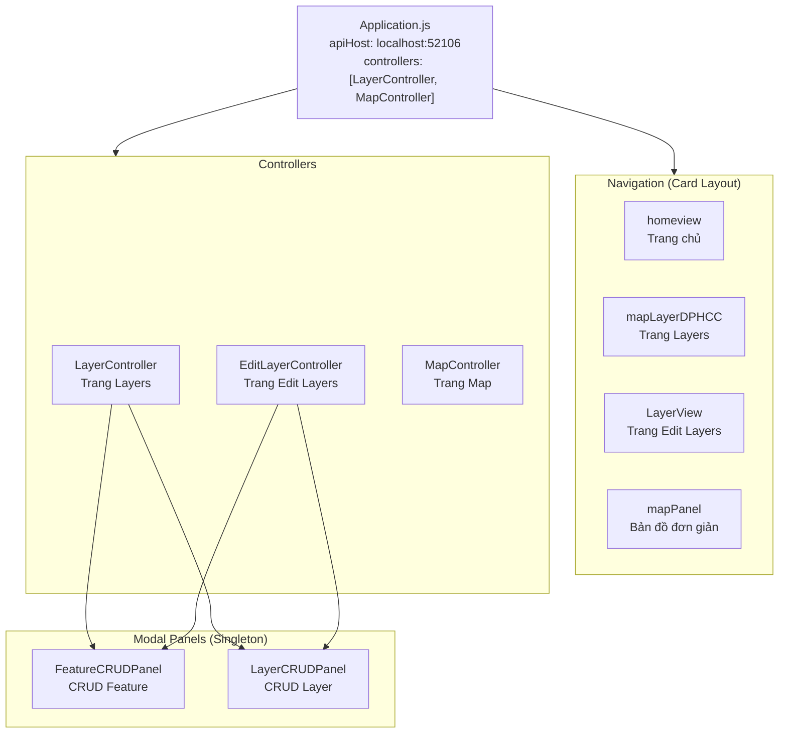
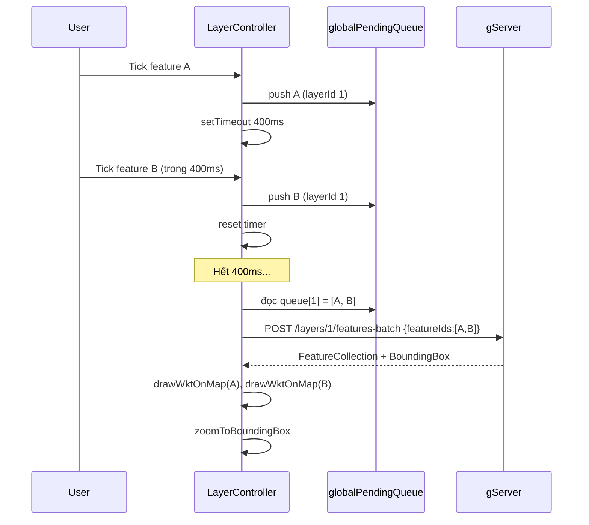
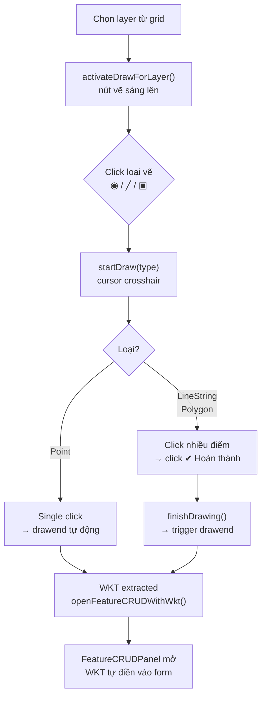

# Frontend — gClient

## Tổng quan

gClient là **SPA (Single Page Application)** xây dựng bằng **ExtJS 8 Modern toolkit**, hiển thị bản đồ bằng **OpenLayers 10**.



---

## ExtJS 8 Modern Toolkit — Quy tắc

!!! danger "Modern ≠ Classic"
    Dự án dùng **Modern toolkit** — nhiều component Classic không tồn tại.

=== "ĐÚNG — Modern"
    ```javascript
    // Panel modal
    Ext.Panel { floated: true, modal: true, centered: true, closeAction: 'hide' }

    // Form fields
    xtype: 'textfield'      // Ext.field.Text
    xtype: 'textareafield'  // Ext.field.TextArea
    xtype: 'selectfield'    // Ext.field.Select

    // Grid
    xtype: 'grid'           // Ext.grid.Grid

    // Toast
    Ext.toast({ message: '...', timeout: 2500 })
    ```

=== "SAI — Classic (không dùng)"
    ```javascript
    // KHÔNG dùng — Classic only
    Ext.window.Window
    Ext.form.field.Text
    Ext.form.Panel
    Ext.grid.Panel
    Ext.Toast({ ... })   // chữ hoa — là Class, không phải helper
    ```

---

## Routing và Navigation

Menu load từ `resources/desktop/menu.json`:

```json
[
    { "text": "Home",        "xtype": "homeview",     "leaf": true },
    { "text": "Edit Layers", "xtype": "LayerView",    "leaf": true },
    { "text": "Map",         "xtype": "mapPanel",     "leaf": true },
    { "text": "Layers",      "xtype": "mapLayerDPHCC","leaf": true }
]
```

`MainViewController` bắt `selectionchange` → `centerview.add({ xtype })` → `setActiveItem(xtype)`.  
`CenterView` dùng `layout: 'card'` — mỗi trang là một card, không reload.

---

## Application.js

```javascript
Ext.define('gClient.Application', {
    extend: 'Ext.app.Application',
    controllers: ['MapController', 'LayerController'],
    config: {
        apiHost: 'http://localhost:52106'
    }
});

// Gọi ở bất kỳ đâu trong app:
var url = gClient.app.getApiHost() + '/LayerService.svc/layers';
```

---

## LayerController — Trang "Layers"

Trang bao gồm panel trái (danh sách layer + grid feature) và panel phải (bản đồ `#map-DPHCC`).

**State quan trọng:**
```javascript
mapPanelRef           // Ext.Panel chứa ol.Map
layerFeatureIds       // { layerId: [featureId, ...] }   tracking on-map features
layerToggleState      // { layerId: bool }                layer on/off
highlightedFeatureId  // ID feature đang highlight
layerStores           // { layerId: FeatureStore }        store per layer
featureCRUDPanel      // singleton FeatureCRUDPanel
layerCRUDPanel        // singleton LayerCRUDPanel
currentDrawLayerId    // layer đang được draw vào
layerList             // cache layer list cho draw toolbar
```

**Cơ chế debounce + batch:**



---

## EditLayerController — Trang "Edit Layers"

Trang chia đôi: **trái = grid layers**, **phải = bản đồ `#edit-layer-map`**.

**Luồng vẽ feature mới:**



---

## OpenLayers 10 — Tích hợp

Load từ CDN trong `index.html`:
```html
<link href="https://cdn.jsdelivr.net/npm/ol@v10.1.0/ol.css" rel="stylesheet">
<script src="https://cdn.jsdelivr.net/npm/ol@v10.1.0/dist/ol.js"></script>
```

**Khởi tạo map:**
```javascript
var olMap = new ol.Map({
    target: 'map-DPHCC',   // DOM id
    layers: [
        new ol.layer.Tile({ source: new ol.source.OSM() })  // nền OSM
    ],
    view: new ol.View({
        center: ol.proj.fromLonLat([105.8342, 21.0278]),    // Hà Nội
        zoom: 13
    })
});
```

**Render WKT lên map:**
```javascript
function drawWktOnMap(wktString, featureId) {
    var olFeature = new ol.format.WKT().readFeature(wktString, {
        dataProjection: 'EPSG:4326',
        featureProjection: olMap.getView().getProjection()
    });
    olFeature.setId(featureId);
    olFeature.setStyle(new ol.style.Style({
        fill:   new ol.style.Fill({ color: 'rgba(24,144,255,0.3)' }),
        stroke: new ol.style.Stroke({ color: '#1890ff', width: 2 }),
        image:  new ol.style.Circle({ radius: 6, fill: ..., stroke: ... })
    }));
    vectorSource.addFeature(olFeature);
}
```

**Draw interaction:**
```javascript
var interaction = new ol.interaction.Draw({
    source: drawSource,
    type: 'LineString'   // 'Point' | 'LineString' | 'Polygon'
});

interaction.on('drawend', function(e) {
    var wkt = new ol.format.WKT().writeFeature(e.feature, {
        dataProjection: 'EPSG:4326',
        featureProjection: olMap.getView().getProjection()
    });
    // wkt = "LINESTRING (105.8 21.0, 105.9 21.1)"
});

olMap.addInteraction(interaction);
```

---

## FeatureCRUDPanel — Modal CRUD

**Pattern Singleton:**
```javascript
// Tạo 1 lần duy nhất, tái sử dụng bằng loadLayer()
if (!me.featureCRUDPanel) {
    me.featureCRUDPanel = Ext.create('gClient.view.FeatureCRUD.FeatureCRUDPanel');
}
me.featureCRUDPanel.getController().loadLayer(
    layerId, layerName, apiHost,
    function(action, fid, data, lId) { /* onAfterChange */ },
    function(drawType, cb) { me.startDrawForUpdate(drawType, cb); }  // onRequestRedraw
);
```

**Redraw hook — tránh hard-code controller:**

Khi panel cần vẽ lại geometry, nó không biết mình đang ở trang nào. Thay vào đó, controller cha **inject callback**:

```javascript
// LayerController inject:
function(drawType, cb) { me.startDrawForUpdate(drawType, cb); }  // dùng map-DPHCC

// EditLayerController inject:
function(drawType, cb) { me.startDrawForUpdate(drawType, cb); }  // dùng edit-layer-map
```

---

## Singleton Ajax pattern

```javascript
Ext.Ajax.request({
    url: gClient.app.getApiHost() + '/LayerService.svc/layers',
    method: 'POST',
    jsonData: { Name: 'Test', LayerType: 'POINT', IsVisible: true, Opacity: 1.0 },
    success: function(response) {
        var result = Ext.decode(response.responseText);
        if (result.Success) {
            Ext.toast({ message: 'Thành công!', timeout: 2000 });
        } else {
            Ext.toast({ message: result.Message, timeout: 3000 });
        }
    },
    failure: function() {
        Ext.toast({ message: 'Lỗi kết nối', timeout: 3000 });
    }
});
```
