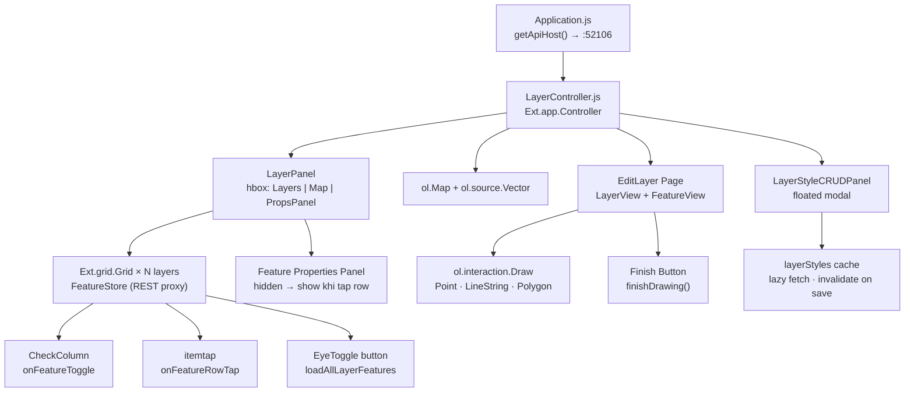
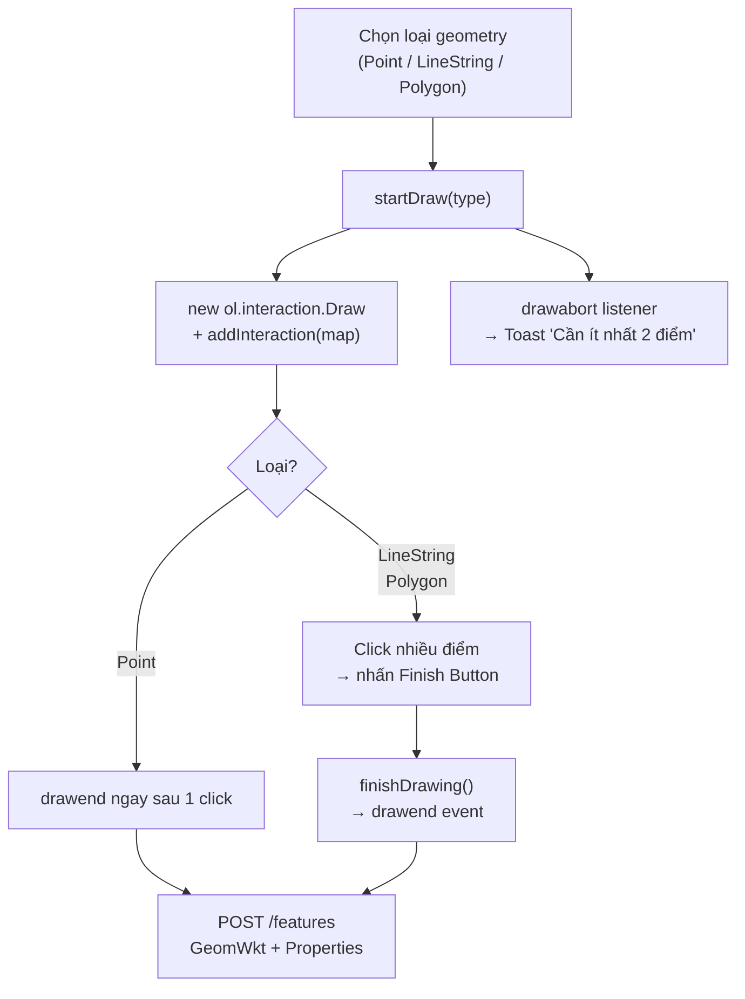

# Frontend — gClient

## Tổng quan

gClient là ứng dụng **ExtJS 8 (Modern toolkit)** chạy qua webpack dev-server (Sencha Cmd),
giao tiếp với gServer qua `Ext.Ajax.request` và hiển thị bản đồ qua **OpenLayers**.

| Thành phần | Vai trò |
|---|---|
| `Application.js` | Cấu hình `apiHost`, đăng ký controller |
| `LayerController.js` | Trung tâm điều phối toàn bộ logic |
| `LayerPanel.js` | Layout chính — hbox: `[Layers | Map | Props]` |
| `EditLayer/` | Trang quản lý layer + vẽ feature lên map |
| `LayerCRUDPanel.js` | Form thêm/sửa layer |
| `FeatureCRUDPanel.js` | Form thêm/sửa feature |
| `LayerStyleCRUDPanel.js` | Modal chỉnh style (fill, stroke, icon) |

---

## Sơ đồ thành phần



---

## Cấu trúc thư mục

```
g-client/app/
├── Application.js              ← apiHost config, controller register
│
├── controller/
│   └── LayerController.js      ← Toàn bộ logic (xem chi tiết bên dưới)
│
├── view/
│   ├── LAYERS/
│   │   └── LayerPanel.js       ← Layout hbox [Layers | Map | Props]
│   │
│   ├── EditLayer/
│   │   ├── LayerView.js        ← Grid danh sách layer (CRUD)
│   │   ├── LayerViewController.js
│   │   ├── FeatureView.js      ← Grid feature của layer
│   │   ├── FeatureFormView.js  ← Form add/edit feature
│   │   └── EditLayerController.js ← Vẽ geometry + finish button
│   │
│   ├── LayerCRUD/
│   │   └── LayerCRUDPanel.js   ← Form thêm/sửa layer (floated modal)
│   │
│   ├── FeatureCRUD/
│   │   └── FeatureCRUDPanel.js ← Form thêm/sửa feature (floated modal)
│   │
│   └── LayerStyleCRUD/
│       └── LayerStyleCRUDPanel.js ← ViewController + Panel style
│
├── model/
│   └── LayerModel.js           ← Ext.data.Model cho layer
│
└── store/
    └── LayerStore.js           ← REST proxy store cho layer
```

---

## LayerController — Danh sách method

### Khởi tạo

| Method | Trigger | Mô tả |
|---|---|---|
| `initOpenLayersMap` | `painted` — MapPanel | Khởi tạo `ol.Map`, `ol.source.Vector`, `ol.layer.Vector` |
| `getLayers` | `painted` — LayerPanel | GET `/layers` → tạo Grid + FeatureStore cho từng layer |

### Layer toggle (eye)

| Method | Trigger | Mô tả |
|---|---|---|
| `loadAllLayerFeatures(layerId)` | Click eye button | Fetch toàn bộ feature của layer, vẽ lên map |
| `clearLayerFromMap(layerId)` | Click eye tắt | Xóa tất cả feature của layer khỏi map |
| `_drawFromCache(layerId, style)` | Có cache | Vẽ từ `layerFeaturesCache` (bỏ qua `hiddenFeatureIds`) |
| `_drawLayerFeatures(layerId, style)` | Không có cache | Gọi API `features-batch` rồi vẽ |

### Feature toggle (checkbox / row tap)

| Method | Trigger | Mô tả |
|---|---|---|
| `handleFeatureToggle(layerId, record)` | `checkchange` | Bật/tắt feature riêng lẻ |
| `onFeatureRowTap(layerId, record)` | `itemtap` | Toggle properties panel / zoom feature |

### Style

| Method | Trigger | Mô tả |
|---|---|---|
| `fetchAndCacheLayerStyle(layerId, cb)` | Trước khi draw | Lazy fetch style → cache `layerStyles` |
| `applyLayerStyle(layerId)` | Sau save style | Áp dụng lại style cho tất cả feature trên map |
| `openLayerStyleCRUD(layerItem)` | Click Edit Style | Mở modal style, dùng cache nếu có |
| `makeOlStyle(style, geomType)` | Khi draw | Tạo `ol.style.Style` phù hợp geomType |

### Render

| Method | Mô tả |
|---|---|
| `drawWktOnMap(wkt, featureId, style)` | Parse WKT → `ol.Feature` → thêm vào VectorSource |
| `zoomToBoundingBox(bbox)` | Zoom map vừa khít vùng dữ liệu |
| `showFeaturePanel(title, props, fid)` | Hiện panel properties bên phải map |
| `hideFeaturePanel()` | Ẩn panel properties |

---

## Layout trang chính — LayerPanel

```
┌─────────────────────────────────────────────────────────────────┐
│  hbox — height: 1050px                                          │
│  ┌──────────────┐  ┌──────────────────────────┐  ┌──────────┐  │
│  │ Layers       │  │  Maps (ol.Map)           │  │ Feature  │  │
│  │ flex: 2      │  │  flex: 3                 │  │ Props    │  │
│  │              │  │                          │  │ flex: 2  │  │
│  │ [Layer 1]    │  │   [Bản đồ OpenLayers]    │  │ hidden   │  │
│  │  ├ Feature A │  │                          │  │ → show   │  │
│  │  ├ Feature B │  │                          │  │ khi tap  │  │
│  │ [Layer 2]    │  │                          │  │ row      │  │
│  └──────────────┘  └──────────────────────────┘  └──────────┘  │
└─────────────────────────────────────────────────────────────────┘
```

---

## Render WKT lên OpenLayers

```
WKT string (từ API)
      │
      ▼
new ol.format.WKT().readFeature(wkt, {
    dataProjection: 'EPSG:4326',
    featureProjection: map.getView().getProjection()
})
      │
      ▼
olFeature.setId(featureId)
olFeature.setStyle(makeOlStyle(style, geomType))
      │
      ▼
vectorSource.addFeature(olFeature)
      │
      ▼
OpenLayers tự render lên <canvas>
```

---

## makeOlStyle — Style theo loại geometry

```js
makeOlStyle: function(style, geomType) {
    var fillColor   = style ? style.FillColor   : '#1890ff';
    var strokeColor = style ? style.StrokeColor : '#fff';
    var width       = style ? style.StrokeWidth : 1.5;
    var iconUrl     = style ? style.IconUrl     : null;

    // POINT / MULTIPOINT
    if (geomType === 'Point' || geomType === 'MultiPoint') {
        var image = iconUrl
            ? new ol.style.Icon({ src: iconUrl, scale: 1.0 })
            : new ol.style.Circle({
                radius: 6,
                fill:   new ol.style.Fill({ color: fillColor }),
                stroke: new ol.style.Stroke({ color: strokeColor, width: 2 })
              });
        return new ol.style.Style({ image: image });
    }

    // POLYGON / LINESTRING
    return new ol.style.Style({
        fill:   new ol.style.Fill({ color: fillColor + '88' }),  // 53% opacity
        stroke: new ol.style.Stroke({ color: strokeColor, width: width })
    });
}
```

---

## Vẽ geometry — EditLayer

Trang EditLayer (`EditLayerController.js`) hỗ trợ vẽ trực tiếp lên bản đồ:



!!! info "Finish Button"
    Với LineString và Polygon, người dùng nhấn **nút ✔ Hoàn thành** để kết thúc vẽ.
    Gọi `finishDrawing()` trên interaction.
    Nếu chưa đủ điểm, OpenLayers bắn sự kiện `drawabort` — hiện Toast thông báo.
