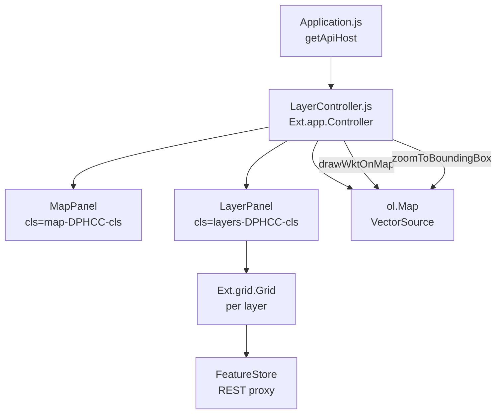
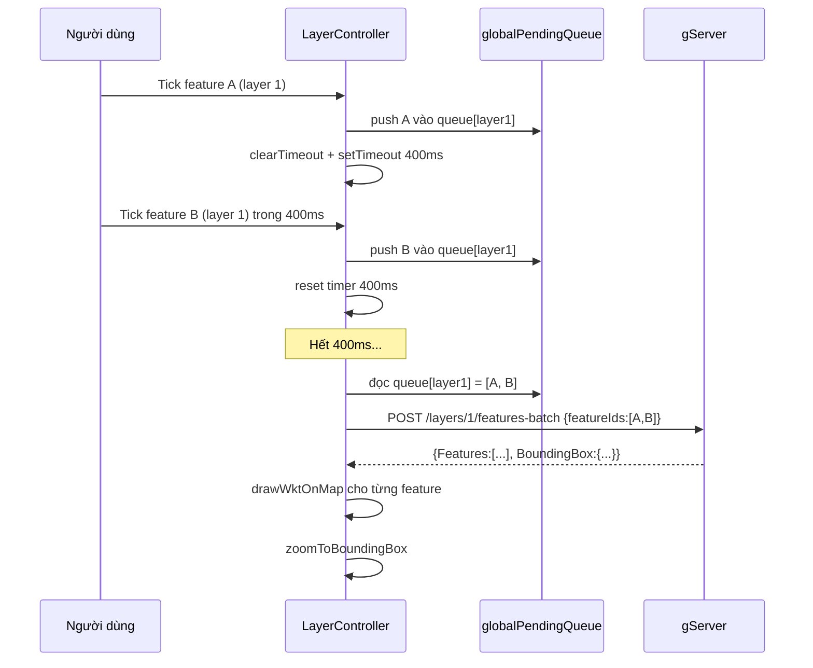

# Frontend — gClient

## Tổng quan

gClient là ứng dụng **ExtJS 8** chạy qua webpack dev server (Sencha Cmd), giao tiếp với gServer qua `Ext.Ajax.request` và hiển thị bản đồ bằng **OpenLayers**.

## Sơ đồ thành phần



## LayerController — Trung tâm điều phối

| Phương thức | Kích hoạt | Vai trò |
|---|---|---|
| `initOpenLayersMap` | `painted` trên MapPanel | Khởi tạo `ol.Map`, `ol.source.Vector` |
| `getLayers` | `painted` trên LayerPanel | Gọi GET `/layers`, tạo Grid cho từng layer |
| `handleFeatureToggle` | `checkchange` trên CheckColumn | Điều phối: cache / single / batch |
| `sendSingleGeometryRequest` | 1 feature đang chờ | GET `/features/{id}/geometry` |
| `sendBatchGeometryRequest` | ≥2 features đang chờ | POST `/layers/{id}/features-batch` |
| `drawWktOnMap` | Sau khi có WKT | Parse WKT → `ol.Feature` → render |
| `zoomToBoundingBox` | Sau batch response | Zoom map vừa khít vùng dữ liệu mới |

## Cơ chế Debounce + Batch



## Render lên bản đồ (drawWktOnMap)

```
WKT string (từ API)
       ↓
ol.format.WKT().readFeature(wkt, {
    dataProjection: 'EPSG:4326',
    featureProjection: map.getView().getProjection()
})
       ↓
Gán ol.style.Style (fill, stroke, circle)
       ↓
vectorSource.addFeature(olFeature)
       ↓
OpenLayers tự render lên canvas
```

## Quản lý style động

Màu sắc lấy từ `LayerStyle` (API `/layers/{id}/style`), fallback về `#1890ff`:

| Loại | Style |
|---|---|
| `POLYGON` | `ol.style.Fill` + `ol.style.Stroke` |
| `LINESTRING` | Chỉ `ol.style.Stroke` |
| `POINT` | `ol.style.Circle` với fill + viền trắng |

## Cấu trúc thư mục

```
gClient_ExtJS/
└── g-client/
    ├── app/
    │   ├── Application.js          ← Cấu hình apiHost
    │   ├── controller/
    │   │   └── LayerController.js  ← Toàn bộ logic
    │   ├── view/
    │   │   ├── map/MapPanel.js
    │   │   └── EditLayer/
    │   │       ├── LayerGrid.js    ← Grid quản lý Layer
    │   │       └── FeatureGrid.js  ← Grid per-layer
    │   ├── store/
    │   │   ├── LayerStore.js
    │   │   └── FeatureStore.js
    │   └── model/
    │       ├── LayerModel.js
    │       └── FeatureModel.js
    ├── index.html
    └── app.json                    ← Sencha Cmd config
```

## Khởi động

```powershell
# PowerShell
.\run-client.ps1          # webpack-dev-server port 1962
```

```bash
# Bash (WSL)
./run-client.sh
```

Mở trình duyệt: `http://localhost:1962`
