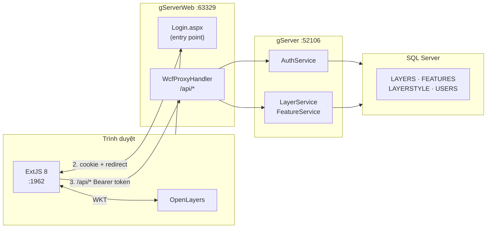

# WebGIS Platform — gServer & gClient

<div class="hero" markdown>
## Hệ thống WebGIS đầy đủ stack

Xây dựng nền tảng quản lý và hiển thị dữ liệu không gian địa lý trên nền web,
gồm **REST API .NET** ở backend, **ExtJS 8** ở frontend, và **OpenLayers** hiển thị bản đồ tương tác.

**Point · LineString · Polygon** — CRUD đầy đủ từ DB đến UI.
</div>

## Tổng quan hệ thống

| Thành phần | Công nghệ | Vai trò |
|---|---|---|
| **gServerWeb** | ASP.NET WebForms 4.5.1 · IIS Express | Entry point — Login, Auth, proxy `/api/*` |
| **gServer** | WCF .NET 4.5.1 · IIS Express | REST JSON API — Layer · Feature · Style · Auth |
| **gClient** | ExtJS 8 (Modern) · webpack | SPA — quản lý layer, feature, user, bản đồ |
| **OpenLayers** | OL 8.x | Render WKT lên bản đồ tương tác |
| **Database** | SQL Server 2016+ Spatial | Lưu `GEOMETRY` SRID 4326, Spatial Index, Users |



## Khởi động nhanh

```powershell
# 1. WCF backend — IIS Express :52106
#    Mở gServer_0.0.1 trong VS2022 → F5

# 2. ASP.NET entry — IIS Express :63329
#    Mở gServerWeb trong VS2022 → F5

# 3. ExtJS client — webpack-dev-server :1962
cd gClient_ExtJS\g-client
npm start

# 4. Tài liệu — MkDocs :8000
cd gServer_Introduction
mkdocs serve
```

Sau đó mở: **`http://localhost:63329/Login.aspx`**

## Port mặc định

| Service | Port | URL |
|---|---|---|
| gServerWeb — entry point | **63329** | `http://localhost:63329/Login.aspx` |
| gServer WCF | **52106** | `http://localhost:52106` |
| gClient ExtJS | **1962** | `http://localhost:1962` |
| MkDocs | **8000** | `http://localhost:8000` |

## Cấu trúc kho mã

```
gServer_0.0.1/
│
├── gServer_0.0.1/              ← Backend WCF .NET
│   ├── IServices/              ← WCF contract interface
│   │   ├── ILayerService.cs
│   │   └── ILayerStyleService.cs
│   ├── Services/               ← Triển khai .svc
│   │   ├── LayerService.cs
│   │   ├── LayerStyleService.cs
│   │   └── WMSService.cs
│   ├── Bussines/               ← Business logic & validation
│   │   ├── LayerBLL.cs
│   │   └── LayerStyleBLL.cs
│   ├── Repositories/           ← SQL thuần (ADO.NET)
│   │   ├── LayerRepository.cs
│   │   └── LayerStyleRepository.cs
│   ├── Models/                 ← Entity + DTO
│   │   ├── Layer.cs  Feature.cs  LayerStyle.cs
│   │   ├── ServiceResult.cs    ← Wrapper response chung
│   │   └── FeatureCollection.cs
│   ├── Helper/                 ← DB, Log utilities
│   │   ├── QueryHelper.cs      ← Async ADO.NET wrapper
│   │   ├── ConnectHelper.cs
│   │   └── LogHelper.cs        ← log4net wrapper
│   ├── LayerService.svc        ← WCF host endpoint
│   ├── LayerStyle.svc
│   └── Web.config              ← Binding + CORS + ConnString
│
├── gClient_ExtJS/              ← Frontend ExtJS 8 + OpenLayers
│   └── g-client/app/
│       ├── Application.js      ← apiHost config
│       ├── controller/
│       │   └── LayerController.js   ← Trung tâm điều phối
│       ├── view/
│       │   ├── LAYERS/         ← LayerPanel (hbox: Layers|Map|Props)
│       │   ├── EditLayer/      ← CRUD Layer + vẽ feature
│       │   ├── FeatureCRUD/    ← Form thêm/sửa feature
│       │   ├── LayerCRUD/      ← Form thêm/sửa layer
│       │   └── LayerStyleCRUD/ ← Form chỉnh style
│       ├── model/
│       │   └── LayerModel.js
│       └── store/
│           └── LayerStore.js
│
├── gServer_Introduction/       ← Tài liệu MkDocs (bạn đang ở đây)
│
├── run-server.ps1 / .sh        ← Khởi động backend
├── run-client.ps1 / .sh        ← Khởi động frontend
└── serve-docs.sh               ← Khởi động tài liệu
```

## Xem thêm

| Tài liệu | Nội dung |
|---|---|
| [Kiến trúc hệ thống](architecture.md) | Sơ đồ 3 tầng, nội bộ BE và FE |
| [Cơ sở dữ liệu](database.md) | ERD, schema, spatial index, SQL mẫu |
| [Backend](backend.md) | WCF layers, code mẫu, CORS, logging |
| [API Reference](api.md) | Tất cả endpoint với request/response mẫu |
| [Frontend](frontend.md) | Component, LayerController, cơ chế hiển thị |
| [Cơ chế nâng cao](frontend-advanced.md) | Style cache, hiddenFeatureIds, vẽ geometry |
| [Luồng dữ liệu](dataflow.md) | Sequence diagram các luồng chính |
| [Đã hoàn thành](done.md) | Checklist tất cả tính năng đã implement |
