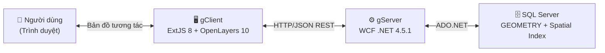

# WebGIS — gClient & gServer

## Giới thiệu dự án

**gServer / gClient** là hệ thống **WebGIS** hoàn chỉnh cho phép quản lý, hiển thị và chỉnh sửa dữ liệu không gian địa lý ngay trên trình duyệt web.

---

## Tech Stack

| Thành phần | Công nghệ | Phiên bản | Vai trò |
|---|---|---|---|
| **Frontend** | ExtJS | 8 (Modern toolkit) | SPA framework, Grid, Panel, Store |
| **Bản đồ** | OpenLayers | 10 (CDN) | Render geometry, Draw interaction |
| **Backend** | WCF REST | .NET 4.5.1 | REST API, JSON response |
| **Database** | SQL Server | 2016+ | Lưu GEOMETRY, Spatial Index |
| **Build tool** | Sencha Cmd | — | Dev server port 1962 |
| **Logging** | log4net | — | Rolling file logs |

---

## URL môi trường Dev

| Thành phần | URL |
|---|---|
| Frontend | `http://localhost:1962` |
| Backend API | `http://localhost:52106/LayerService.svc` |
| Database | `Server=10.0.1.207\sql2k16;Database=gServer_dev_DB` |

---

## Tính năng chính

!!! success "Quản lý Layer"
    Thêm / sửa / xóa lớp bản đồ (POINT, LINESTRING, POLYGON).  
    Mỗi layer có metadata: tên, mô tả, kiểu hình học, độ mờ, zoom range.

!!! success "Hiển thị Feature trên bản đồ"
    Bật/tắt từng feature theo checkbox. Hệ thống tự gom batch request (debounce 400ms) để tối ưu.  
    Click feature trên map → popup thuộc tính. Click map rỗng → Identify nearest feature.

!!! success "CRUD Feature có WKT"
    Thêm / sửa / xóa feature. Nhập WKT tay hoặc **vẽ trực tiếp trên bản đồ**.  
    Hỗ trợ 3 loại hình học: Point, LineString, Polygon.

!!! success "Vẽ lại Geometry"
    Khi sửa feature, có thể **vẽ lại hình học** (redraw) trực tiếp trên bản đồ thay vì nhập WKT bằng tay.

---

## Yêu cầu hệ thống

- .NET Framework 4.5.1
- SQL Server 2016+ (cần kiểu `GEOMETRY` và Spatial Index)
- Node.js + Sencha Cmd (chạy dev server frontend)
- Trình duyệt hiện đại: Chrome, Edge
- IIS Express (chạy WCF backend)
