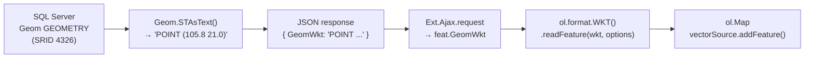

# Module: Vẽ & WKT

## WKT là gì?

**WKT (Well-Known Text)** là chuẩn text để biểu diễn hình học địa lý.  
Toàn bộ dự án giao tiếp geometry dưới dạng WKT — không dùng binary, không dùng ảnh.

```
POINT (105.845 21.028)
LINESTRING (105.8 21.0, 105.85 21.05, 105.9 21.1)
POLYGON ((105.80 21.00, 105.85 21.00, 105.85 21.05, 105.80 21.05, 105.80 21.00))
```

**Thứ tự tọa độ:** `longitude (X)` trước, `latitude (Y)` sau — theo chuẩn OGC WKT.

---

## Luồng WKT — Từ DB đến bản đồ



---

## Vẽ WKT từ API lên bản đồ

```javascript
function drawWktOnMap(wktString, featureId, colorHex) {
    var mapPanel = me.mapPanelRef;  // hoặc me.olMap

    // Xóa feature cũ nếu đã render trước đó
    var old = mapPanel.vectorSource.getFeatureById(featureId);
    if (old) mapPanel.vectorSource.removeFeature(old);

    // Parse WKT → ol.Feature
    var olFeat = new ol.format.WKT().readFeature(wktString, {
        dataProjection:    'EPSG:4326',                      // tọa độ trong WKT (lon/lat)
        featureProjection: mapPanel.map.getView().getProjection()  // tọa độ map (thường là EPSG:3857)
    });

    olFeat.setId(featureId);

    // Style
    var color = colorHex || '#1890ff';
    olFeat.setStyle(new ol.style.Style({
        fill:   new ol.style.Fill({ color: hexToRgba(color, 0.3) }),
        stroke: new ol.style.Stroke({ color: color, width: 2 }),
        image:  new ol.style.Circle({
            radius: 6,
            fill:   new ol.style.Fill({ color: color }),
            stroke: new ol.style.Stroke({ color: '#ffffff', width: 1.5 })
        })
    }));

    mapPanel.vectorSource.addFeature(olFeat);
    return olFeat;
}
```

---

## Lưu WKT từ vẽ tay (Draw interaction)

```javascript
// Khi drawend fires:
interaction.on('drawend', function(e) {
    var wkt = new ol.format.WKT().writeFeature(e.feature, {
        dataProjection:    'EPSG:4326',
        featureProjection: olMap.getView().getProjection()
    });
    // wkt = "POLYGON ((105.80 21.00, ...))"  ← text thuần gửi lên API
});
```

---

## 3 loại geometry — Cách vẽ

=== "Point"
    ```javascript
    new ol.interaction.Draw({ source: drawSource, type: 'Point' })
    // → Single click → drawend tự fire ngay lập tức
    // → Không cần finishBtn
    ```

=== "LineString"
    ```javascript
    new ol.interaction.Draw({ source: drawSource, type: 'LineString' })
    // → Click để thêm điểm
    // → Double-click để kết thúc (drawend)
    // HOẶC click finishBtn → drawInteraction.finishDrawing() → drawend
    ```

=== "Polygon"
    ```javascript
    new ol.interaction.Draw({ source: drawSource, type: 'Polygon' })
    // → Click để thêm điểm
    // → Double-click để đóng polygon (drawend)
    // HOẶC click finishBtn → drawInteraction.finishDrawing() → drawend
    // OL tự đóng polygon (thêm điểm đầu vào cuối)
    ```

---

## finishDrawing() — Kết thúc vẽ bằng button

Thay vì bắt user double-click, ta có button `✔ Hoàn thành`:

```javascript
// Tạo trong createDrawToolbar()
var finishBtn = document.createElement('button');
finishBtn.textContent = '✔ Hoàn thành';
finishBtn.style.display = 'none';  // ẩn mặc định
finishBtn.onclick = function() {
    if (me.drawInteraction) {
        me.drawInteraction.finishDrawing();  // trigger drawend
    }
};
me.finishBtn = finishBtn;  // lưu ref trên controller

// Hiện khi vẽ Line/Polygon:
if (me.finishBtn) {
    me.finishBtn.style.display = (type === 'Point') ? 'none' : 'inline-block';
}

// Ẩn khi stopDraw():
if (me.finishBtn) {
    me.finishBtn.style.display = 'none';
}
```

!!! warning "Ref phải lưu trên controller (`me`), không phải panel"
    `me.finishBtn` — không phải `mapPanel.finishBtn`. Controller là singleton, panel là Ext component.

---

## Draw Preview Layer

Khi đang vẽ, geometry hiện ra dạng preview (dashed blue) trên layer riêng:

```javascript
drawSource = new ol.source.Vector();
olMap.addLayer(new ol.layer.Vector({
    source: drawSource,
    style: new ol.style.Style({
        fill:   new ol.style.Fill({ color: 'rgba(0,120,255,0.18)' }),
        stroke: new ol.style.Stroke({ color: '#0078ff', width: 2, lineDash: [6, 3] }),
        image:  new ol.style.Circle({ radius: 6, fill: ..., stroke: ... })
    })
}));

// Sau drawend, xóa preview:
setTimeout(function() {
    if (drawSource) drawSource.clear();
}, 350);
```

---

## Highlight Style — Feature được chọn

```javascript
// Màu cam khi highlight
new ol.style.Style({
    fill:   new ol.style.Fill({ color: 'rgba(255,140,0,0.45)' }),
    stroke: new ol.style.Stroke({ color: '#ff6600', width: 3 }),
    image:  new ol.style.Circle({
        radius: 8,
        fill:   new ol.style.Fill({ color: '#ff6600' }),
        stroke: new ol.style.Stroke({ color: '#ffffff', width: 2 })
    })
})

// Reset về default:
feature.setStyle(null);  // về style của layer
```

---

## Gotcha: drawend + singleclick trên Point

Khi vẽ Point, OL fire cả `drawend` lẫn `singleclick` trên cùng 1 click.  
`singleclick` handler sẽ trigger Identify — không mong muốn.

**Fix:**
```javascript
interaction.on('drawend', function(e) {
    // ...
    mapPanel.drawJustEnded = true;
    setTimeout(function() {
        mapPanel.drawJustEnded = false;
    }, 350);
});

// Trong singleclick handler:
panel.map.on('singleclick', function(evt) {
    if (panel.activeDrawType || panel.drawJustEnded) {
        panel.drawJustEnded = false;
        return;  // bỏ qua
    }
    // ... xử lý identify bình thường
});
```

---

## WKT examples — Việt Nam

```
Hà Nội (Point):
POINT (105.8342 21.0278)

Đường Hồ Chí Minh đoạn mẫu (LineString):
LINESTRING (105.8 21.0, 105.85 21.05, 105.9 21.1)

Ranh giới ô vuông mẫu (Polygon):
POLYGON ((105.80 21.00, 105.85 21.00, 105.85 21.05, 105.80 21.05, 105.80 21.00))
```
