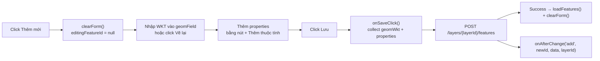

# Module: FeatureCRUDPanel

**File:** `app/desktop/src/view/FeatureCRUD/FeatureCRUDPanel.js`  
**Xtype:** `featurecrudpanel`  
**Controller alias:** `featurecrudvc`  
**Pattern:** Singleton — tạo 1 lần, đổi context bằng `loadLayer()`

---

## Layout

```
┌──────────────────────────────────────────────────────────────┐
│  Quản lý Feature — [Tên Layer]                          [✕]  │
│  ──────────────────────────────────────────────────────────  │
│  ┌─────────────────────────┐  │  ┌──────────────────────┐   │
│  │  Panel trái (flex 5)    │  │  │  Panel phải (flex 4) │   │
│  │                         │  │  │  Thêm Feature mới    │   │
│  │  [+ Thêm][🗑 Xóa] [↻]  │  │  │                      │   │
│  │                         │  │  │  Hình học (WKT):     │   │
│  │  Grid features:         │  │  │  ┌──────────────────┐│   │
│  │  ┌────┬──────────────┐  │  │  │  │ POINT (105.8...) ││   │
│  │  │ ID │ Thông tin    │  │  │  │  └──────────────────┘│   │
│  │  ├────┼──────────────┤  │  │  │                      │   │
│  │  │  1 │ BV Bạch Mai  │  │  │  │  Vẽ lại:            │   │
│  │  │  2 │ Trường ĐH    │  │  │  │  [◉ Điểm][╱][▣]    │   │
│  │  └────┴──────────────┘  │  │  │                      │   │
│  └─────────────────────────┘  │  │  Thuộc tính:         │   │
│                                │  │  [ten      ][Giá trị]│   │
│                                │  │  [loai     ][Giá trị]│   │
│                                │  │  [+ Thêm thuộc tính] │   │
│                                │  │                      │   │
│                                │  │  [Lưu] [Hủy]        │   │
│                                │  └──────────────────────┘   │
└──────────────────────────────────────────────────────────────┘
```

---

## API của ViewController

### `loadLayer(layerId, layerName, apiHost, onAfterChange, onRequestRedraw)`

Điểm duy nhất để đổi context panel. Phải gọi trước khi `show()`.

```javascript
vc.loadLayer(
    layerId,
    layerName,
    apiHost,
    function(action, featureId, data, layerId) {
        // action: 'add' | 'update' | 'delete'
        // Được gọi sau khi save/delete thành công
    },
    function(drawType, callback) {
        // drawType: 'Point' | 'LineString' | 'Polygon'
        // callback(wkt): được gọi sau khi vẽ xong
        // Controller cha inject hàm này để panel không biết map nào
        me.startDrawForUpdate(drawType, callback);
    }
);
```

---

## State trên `view`

```javascript
view.currentLayerId      // layer đang làm việc
view.currentApiHost      // base URL
view.editingFeatureId    // null = thêm mới, có giá trị = đang sửa
view.onAfterChange       // callback notify controller cha
view.onRequestRedraw     // callback inject từ controller cha để draw
```

---

## Luồng Thêm Feature



---

## Luồng Sửa Feature

```mermaid
flowchart LR
    A["Click row trong grid"] --> B["onGridSelectionChange()"]
    B --> C["loadFeatureIntoForm(record)"]
    C --> D["GET /features/{id}"]
    D --> E["geomField.setValue(feat.GeomWkt)"]
    E --> F["addPropRow cho mỗi property"]
    F --> G["editingFeatureId = featureId"]
    G --> H["Sửa WKT hoặc click Vẽ lại"]
    H --> I["Click Lưu → onSaveClick()"]
    I --> J["PUT /features/{id}"]
    J --> K["onAfterChange('update', ...)"]
```



---

## Vẽ lại Geometry — onRedrawClick

```javascript
onRedrawClick: function(btn) {
    var me       = this,
        view     = me.getView(),
        drawType = btn.drawType;  // 'Point' | 'LineString' | 'Polygon'

    if (!view.onRequestRedraw) {
        Ext.toast({ message: 'Chức năng vẽ chưa kết nối bản đồ', timeout: 2500 });
        return;
    }

    view.hide();  // ẩn panel để thấy bản đồ

    view.onRequestRedraw(drawType, function(wkt) {
        var geomField = me.lookup('geomField');
        if (geomField) geomField.setValue(wkt);
        view.show();  // hiện lại panel
    });
}
```

**Button config trong view:**
```javascript
{ xtype: 'button', text: '◉ Điểm',  drawType: 'Point',      handler: 'onRedrawClick' },
{ xtype: 'button', text: '╱ Đường', drawType: 'LineString',  handler: 'onRedrawClick' },
{ xtype: 'button', text: '▣ Vùng',  drawType: 'Polygon',     handler: 'onRedrawClick' }
```

---

## Thu thập Properties

Properties lưu dưới dạng key-value rows động trong `propsContainer`.

```javascript
onSaveClick: function() {
    var properties = {};

    propsContainer.getItems().each(function(row) {
        var keyFld = row.getComponent(0);  // textfield key
        var valFld = row.getComponent(1);  // textfield value
        var k = (keyFld.getValue() || '').trim();
        if (k) properties[k] = valFld.getValue() || '';
    });

    // Gửi lên server
    Ext.Ajax.request({
        url: isNew ? apiHost + '/layers/' + layerId + '/features'
                   : apiHost + '/features/' + featureId,
        method: isNew ? 'POST' : 'PUT',
        jsonData: {
            Id: featureId ? String(featureId) : '0',
            GeomWkt: geomWkt,
            Properties: JSON.stringify(properties)  // JSON string
        }
    });
}
```

---

## addPropRow — Thêm dòng thuộc tính

```javascript
addPropRow: function(container, key, value) {
    var row = Ext.create('Ext.Container', {
        layout: { type: 'hbox', align: 'middle' },
        items: [
            { xtype: 'textfield', flex: 1, placeholder: 'Tên thuộc tính', value: key || '' },
            { xtype: 'textfield', flex: 2, placeholder: 'Giá trị',         value: value || '' },
            {
                xtype: 'button', iconCls: 'x-fa fa-times', ui: 'decline',
                handler: function() { container.remove(row, true); }
            }
        ]
    });
    container.add(row);
}
```

---

## onAfterChange — Notify Controller cha

Sau khi save/delete thành công, panel gọi `view.onAfterChange`:

```javascript
onAfterChange(action, featureId, data, layerId)
// action = 'add'    → controller cha reload store
// action = 'update' → controller cha cập nhật WKT trên map
// action = 'delete' → controller cha xóa feature khỏi map
```

**LayerController xử lý:**
```javascript
onFeatureCRUDChange: function(action, featureId, data, layerId) {
    me.reloadLayerStore(layerId);

    if (action === 'delete') {
        vectorSource.removeFeature(vectorSource.getFeatureById(featureId));
    } else if (action === 'update' && data && data.geomWkt) {
        if (vectorSource.getFeatureById(featureId)) {
            me.drawWktOnMap(data.geomWkt, featureId);  // cập nhật hình
        }
    }
}
```
