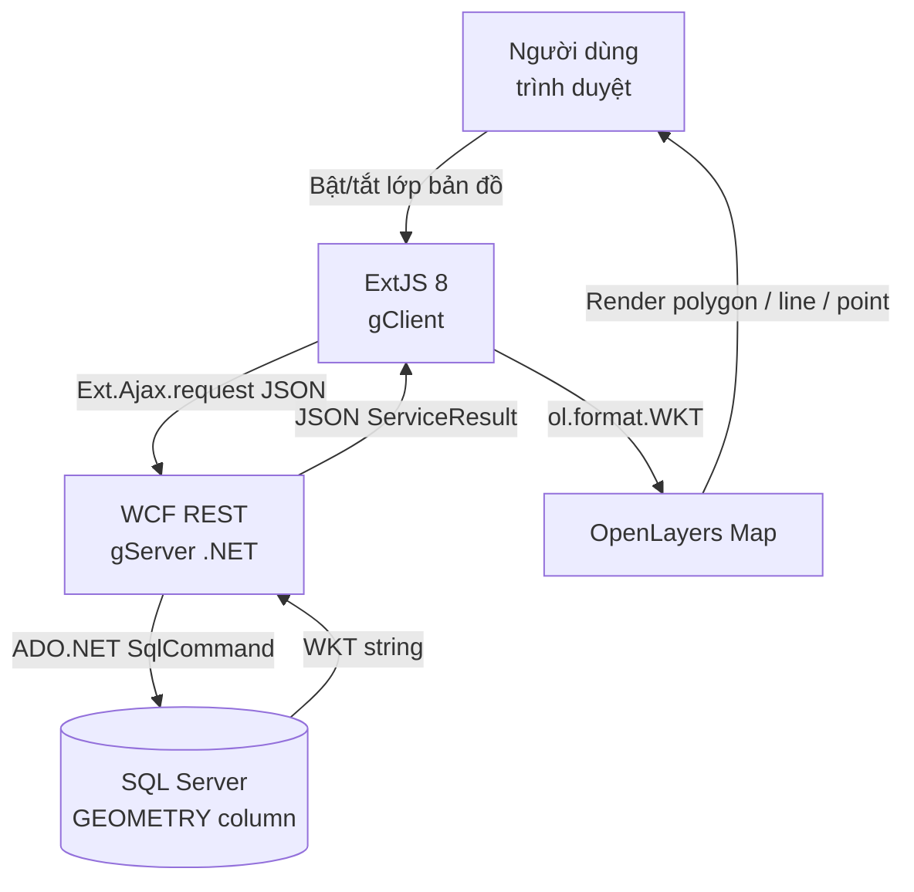

# Bài toán & Giải pháp

## Bài toán đặt ra

Các tổ chức cần **quản lý và trực quan hóa dữ liệu địa lý** (ranh giới hành chính, điểm quan trắc, tuyến đường...) nhưng gặp khó khăn:

- Dữ liệu hình học phức tạp (`POLYGON`, `LINESTRING`, `POINT`) khó lưu trữ và truy vấn
- Cần giao diện web cho phép bật/tắt từng lớp bản đồ theo nhu cầu
- Khi người dùng chọn nhiều đối tượng liên tiếp → nhiều request API → chậm
- Hệ thống legacy dùng WCF .NET cần tích hợp với frontend hiện đại

## Sơ đồ giải pháp

## Lý do chọn từng công nghệ

| Công nghệ | Lý do lựa chọn |
|---|---|
| **WCF .NET 4.5.1** | Tương thích hệ thống legacy, `webHttpBinding` cho REST/JSON |
| **SQL Server GEOMETRY** | Kiểu không gian gốc, `STAsText()` · `STIntersects()` · Spatial Index |
| **NetTopologySuite 1.15.3** | Parse WKT C# phía server, tính bounding box |
| **ExtJS 8** | Framework doanh nghiệp — Grid, Store, Panel sẵn có |
| **OpenLayers** | Mã nguồn mở, hỗ trợ WKT, WMS, WMTS, EPSG:4326/3857 |

## Tính năng đã hoàn thành

!!! success "CRUD đầy đủ"
    - Quản lý lớp bản đồ: tạo, sửa, xóa, liệt kê (endpoint `/layers`)
    - Quản lý đối tượng không gian: thêm, sửa, xóa từng feature
    - Quản lý style hiển thị: màu fill, stroke, icon cho từng layer

!!! success "Tối ưu client"
    - Cache geometry tại client — không gọi API lặp với cùng feature
    - Debounce 400ms để gom batch request khi tick nhanh
    - Batch API `/features-batch` — 1 request thay vì N request

!!! success "Tích năng nâng cao"
    - Import hàng loạt `FeatureCollection` vào một layer
    - Identify không gian: tìm feature giao với điểm lon/lat (buffer 5m)
    - Zoom tự động vừa khít bounding box sau mỗi batch

## Tối ưu hiệu năng

| Vấn đề | Giải pháp |
|---|---|
| N request khi tick nhanh | Debounce 400ms + gom batch |
| Gọi API lại khi tick cùng feature | Cache `Geom` vào Ext record |
| Re-render khi cập nhật cache | `record.set('Geom', wkt, {silent: true})` |
| Bản đồ không vừa vùng mới | `zoomToBoundingBox` sau mỗi batch response |
