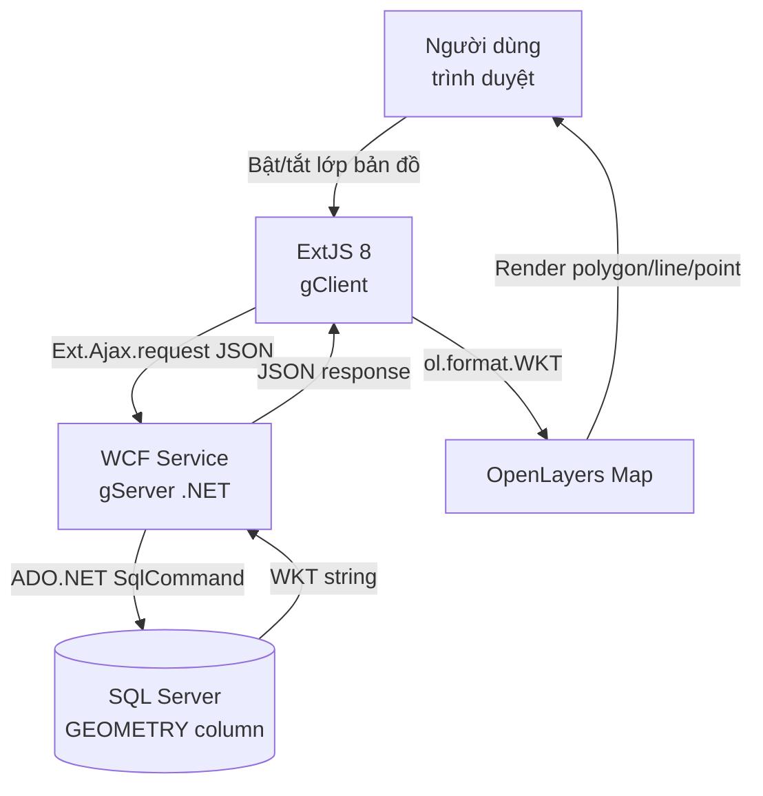

# Bài toán & Giải pháp

## Bài toán đặt ra

Nhiều tổ chức cần **quản lý và trực quan hóa dữ liệu địa lý** (ranh giới hành chính, điểm quan trắc, tuyến đường...) nhưng gặp khó khăn vì:

- Dữ liệu hình học phức tạp (polygon, polyline, point) khó lưu trữ và truy vấn
- Cần giao diện web cho phép bật/tắt từng lớp bản đồ theo nhu cầu
- Khi người dùng chọn nhiều đối tượng liên tiếp → tốn nhiều request API → chậm
- Hệ thống legacy sử dụng WCF .NET cần tích hợp với frontend hiện đại

## Giải pháp công nghệ

### Sơ đồ tổng quát

### Lý do chọn từng công nghệ

| Công nghệ | Lý do lựa chọn |
|---|---|
| **WCF .NET 4.5.1** | Tương thích hệ thống legacy công ty, hỗ trợ SOAP + REST |
| **SQL Server GEOMETRY** | Kiểu dữ liệu không gian gốc, hỗ trợ `STAsText()`, `STIntersects()`, Spatial Index |
| **ExtJS 8** | Framework doanh nghiệp, Grid/Panel/Store sẵn có |
| **OpenLayers** | Thư viện bản đồ mã nguồn mở, hỗ trợ WKT, WMS, WMTS, WFS |

## Tính năng chính

!!! success "Đã hoàn thành"
    - Quản lý CRUD lớp bản đồ (LAYERS)
    - Hiển thị danh sách feature theo layer trong Grid
    - Bật/tắt feature → render WKT lên bản đồ
    - Cache geometry tại client (tránh gọi API trùng lặp)
    - Debounce 400ms để gom batch request

!!! info "Tối ưu thông minh"
    Khi người dùng tick nhiều feature liên tiếp trong 400ms, hệ thống **gom thành 1 request batch** thay vì N request riêng lẻ. Chỉ gọi API đơn lẻ nếu chỉ chọn 1 feature.
